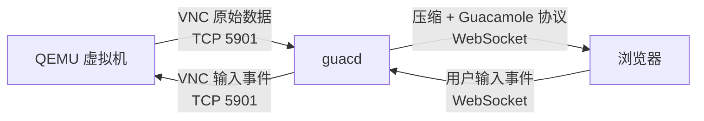
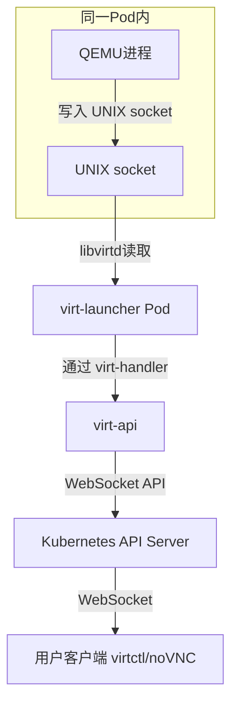
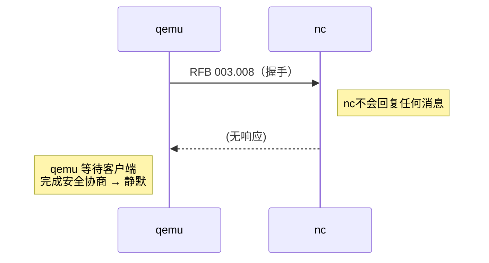
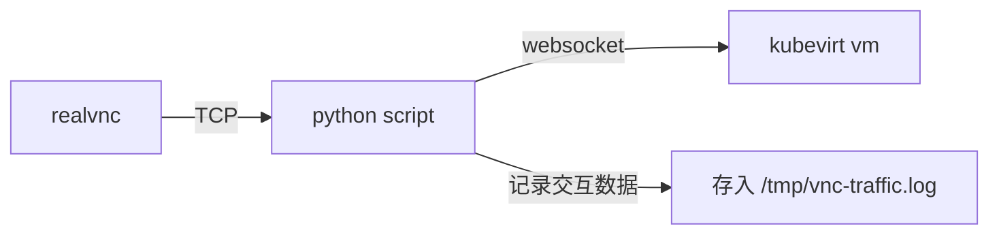

## 环境

```
Host jcjy-chenqi-test
    HostName 192.168.1.150
    User jcjy
```

设置KUBECONFIG

windows

```bash
$env:KUBECONFIG="C:\Users\Gloria_X\.kube\chenqi.config"
```

mac

```bash
echo 'export KUBECONFIG=~/.kube/chenqi.config' >> ~/.zshrc
source ~/.zshrc
```


## 用`guacmole`消费你自己的`qemu`开出来`vnc`的端口，然后跑通

1. 启动`qemu`
2. 把`guacmole` forword到本地
3. 把`qemu`的ip+端口，配到 guac中vnc连通

#### 知识点：

qemu 可以模拟虚拟机的 VGA 显示输出，通过 TCP 端口 5901 提供vnc服务

- 原始数据量非常大

1s数据量：分辨率 * 颜色通道 * 每秒帧数 = 1920 × 1080 像素× 3（RGB 三个通道）× 1byte/通道× 60 帧/秒（60Hz）

> **原始、未压缩**的像素数据流，直接传输不现实

- qemu 中检测变化区域，只将变化的部分编码成vnc协议格式发送

guacd：

1. 从qemu的vnc服务(5901)中接收vnc协议数据
2. 将vnc数据压缩，封装成更高效的 Guacmole协议，通过websocket发送给浏览器

> guacmole是个web前端项目client，通过ws和guacd通信，在浏览器中渲染出桌面，如果有其他能解析 Guacamole协议的客户端，也可以不安装




#### 启动`qemu`

```bash
ssh jcjy-chenqi-test

cd /home/jcjy/data

sudo qemu-system-x86_64 \
-enable-kvm \
-m 4096 \
-smp 4 \
-drive file=win10.qcow2,format=qcow2 \
-vnc 0.0.0.0:1,password=on \
-vga virtio \
-device virtio-keyboard \
-device virtio-tablet \
-monitor stdio


QEMU 6.2.0 monitor - type 'help' for more information
(qemu) qemu-system-x86_64: warning: host doesn't support requested feature: CPUID.80000001H:ECX.svm [bit 2]
qemu-system-x86_64: warning: host doesn't support requested feature: CPUID.80000001H:ECX.svm [bit 2]
qemu-system-x86_64: warning: host doesn't support requested feature: CPUID.80000001H:ECX.svm [bit 2]
qemu-system-x86_64: warning: host doesn't support requested feature: CPUID.80000001H:ECX.svm [bit 2]

(qemu)
(qemu)
(qemu) change vnc password
Password: ******
(qemu)
```

> -vnc 0.0.0.0:1 会监听所有网络接口上的 5901
>
> ,password=on, -monitor stdio 设置密码，为了解决guac连接时会自动填充默认密码的问题

##### 检验qemu是否开启

1. 打洞到本机5901，vnc连接

```bash
ssh -p 46811 -L 5901:192.168.1.150:5901 rens@jcjy.synology.me
```

2.  使用 无头模式（headless） 的 VNC 客户端

```bash
# 安装 pip 和 vncdotool
$ sudo apt update && sudo apt install -y python3-pip
$ pip3 install vncdotool

# 测试连接并截图（不依赖图形界面）
$ vncdo -s 127.0.0.1::5901 -p 123456 capture /tmp/screen.png

$ ls -l /tmp/screen.png
-rw-rw-r-- 1 jcjy jcjy 726510 Jan 26 05:43 /tmp/screen.png
```

##### 查看qemu进程

```bash
ps aux | grep qemu
```

kill

```bash
sudo kill 12345
```


#### 把 guacmole forword到本地

```bash
kubectl port-forward pod/middleware-guacamole-guacamole-776fc7776-kpqn6 7788:8080 -n ai-deliver
```

访问：http://localhost:7788


guacmole配置文件（其中不含账号密码）

```
GUACD_HOSTNAME : guacamole-guacd 
GUACD_PORT : 4822 
POSTGRES_DATABASE : guacamole 
POSTGRES_HOSTNAME : middleware-postgresql 
POSTGRES_PASSWORD : password 
POSTGRES_PORT : 5432 
POSTGRES_USER : guacamole 
WEBAPP_CONTEXT : ROOT
```

默认密码

账号：guacadmin

密码：guacadmin


去postgres里找

```bash
$ kubectl exec -it middleware-postgresql-0 -n ai-deliver -- bash
I have no name!@middleware-postgresql-0:/$ psql -U guacamole -d guacamole -h middleware-postgresql
Password for user guacamole:
psql (16.4)
Type "help" for help.

guacamole=> SELECT * FROM guacamole_user;
 user_id | entity_id |                           password_hash                            |                           pa
ssword_salt                            |         password_date         | disabled | expired | access_window_start | acce
ss_window_end | valid_from | valid_until | timezone | full_name | email_address | organization | organizational_role
---------+-----------+--------------------------------------------------------------------+-----------------------------
---------------------------------------+-------------------------------+----------+---------+---------------------+-----
--------------+------------+-------------+----------+-----------+---------------+--------------+---------------------
       1 |         1 | \xca458a7d494e3be824f5e1e175a1556c0f8eef2c2d7df3633bec4a29c4411960 | \xfe24adc5e11e2b25288d1704ab
e67a79e342ecc26064ce69c5b3177795a82264 | 2025-08-29 09:55:01.893486+00 | f        | f       |                     |
              |            |             |          |           |               |              |
(1 row)
```


#### 在guacmole里连接qemu

节点内部的pod网关

```bash
jcjy@jcjy-msi:~$ ip addr show cni0
16: cni0: <BROADCAST,MULTICAST,UP,LOWER_UP> mtu 1450 qdisc noqueue state UP group default qlen 1000
    link/ether 3e:37:08:37:c0:25 brd ff:ff:ff:ff:ff:ff
    inet 10.244.0.1/24 brd 10.244.0.255 scope global cni0
       valid_lft forever preferred_lft forever
```


exec到guac的pod里检测能否连上qemu端口

```bash
kubectl exec -it middleware-guacamole-guacd-79c847569d-5nzp5 -n ai-deliver -- sh

/ $ nc -vz 10.244.0.1 5901
Connection to 10.244.0.1 5901 port [tcp/*] succeeded!
```


qemu中已有一位用户连接，QEMU 默认 VNC 是 **独占模式**（一个客户端）

如果还想保留多客户端能力，下次启动 QEMU 时加上 `,share=force-shared`

```bash
(qemu) info vnc
default:
  Server: 0.0.0.0:5901 (ipv4)
    Auth: vnc (Sub: none)
  Client: 192.168.1.96:49196 (ipv4)
    x509_dname: none
    sasl_username: none
```


保存连接时，注意！！存的是**`hostname` 和 `port`**，不是 `guacd-hostname` / `guacd-port`...

```bash
curl 'http://localhost:7788/api/session/data/postgresql/connections/55' \
  -X 'PUT' \
  -H 'Accept: application/json, text/plain, */*' \
  -H 'Accept-Language: zh-CN,zh;q=0.9,en;q=0.8,en-GB;q=0.7,en-US;q=0.6' \
  -H 'Cache-Control: no-cache' \
  -H 'Connection: keep-alive' \
  -H 'Content-Type: application/json;charset=UTF-8' \
  -b '_SSID=-QF2dmJnNZM0tQ11DoCPXMCuGpks2bt30U1qSIOEHU8; stay_login=1; did=kJ_diTps1fg602fREClwV9uu0ewmTontUE7qDFqyQiyoJ2nupp1RUfqMajtLDQhWVVW3gXy8k9swP8gfSfD8VA; _CrPoSt=cHJvdG9jb2w9aHR0cDo7IHBvcnQ9NTIzMzsgcGF0aG5hbWU9Lzs%3D; Hm_lvt_f2aba47f2df30d0e5c4f5c0704afb211=1765712689,1765716320,1765762872,1765865276; trilium.sid=s%3AnbWu3iaM8XOb2ZdIIutmoV9sc3BhMAvv.9B1Q97nU3RhaIYbjYtP8askUjM%2F70AI1MW5PqC6t2kA; trilium-device=desktop; _csrf=z8fJdAYVF-lBkKqSNHbSdWT0' \
  -H 'Guacamole-Token: 7F4B0D755471413A1ED74F4C7E7BE1E3FFEC8CBD00547633DB9366756529B078' \
  -H 'Origin: http://localhost:7788' \
  -H 'Pragma: no-cache' \
  -H 'Referer: http://localhost:7788/' \
  -H 'Sec-Fetch-Dest: empty' \
  -H 'Sec-Fetch-Mode: cors' \
  -H 'Sec-Fetch-Site: same-origin' \
  -H 'User-Agent: Mozilla/5.0 (Windows NT 10.0; Win64; x64) AppleWebKit/537.36 (KHTML, like Gecko) Chrome/144.0.0.0 Safari/537.36 Edg/144.0.0.0' \
  -H 'sec-ch-ua: "Not(A:Brand";v="8", "Chromium";v="144", "Microsoft Edge";v="144"' \
  -H 'sec-ch-ua-mobile: ?0' \
  -H 'sec-ch-ua-platform: "Windows"' \
  --data-raw '{"name":"qemu","identifier":"55","parentIdentifier":"ROOT","protocol":"vnc","attributes":{"guacd-encryption":"","failover-only":"","weight":"","max-connections":"","guacd-hostname":"","guacd-port":"","max-connections-per-user":""},"activeConnections":0,"parameters":{"password":"123456","port":"5901","read-only":"","swap-red-blue":"","cursor":"","color-depth":"","force-lossless":"","clipboard-encoding":"","disable-copy":"","disable-paste":"","dest-port":"","recording-exclude-output":"","recording-exclude-mouse":"","recording-include-keys":"","create-recording-path":"","enable-sftp":"","sftp-port":"","sftp-server-alive-interval":"","sftp-disable-download":"","sftp-disable-upload":"","enable-audio":"","wol-send-packet":"","wol-udp-port":"","wol-wait-time":"","hostname":"10.244.0.1"}}'
```


数据库可查

```bash
jcjy@jcjy-msi:~$ kubectl exec -it middleware-postgresql-0 -n ai-deliver -- psql -U guacamole -d guacamole
Password for user guacamole:
psql (16.4)
Type "help" for help.

guacamole=> SELECT connection_id, connection_name FROM guacamole_connection;
 connection_id |         connection_name
---------------+---------------------------------
            55 | qemu
            37 | test-1111111111111111111
            53 | kvmlinux-1-vsrakogbd11122233434
(3 rows)

guacamole=> SELECT *
FROM guacamole_connection_parameter
WHERE connection_id = 55;
 connection_id | parameter_name | parameter_value
---------------+----------------+-----------------
            55 | password       | 123456
            55 | hostname       | 10.244.0.1
            55 | port           | 5901
(3 rows)
```


## 用websocket客户端去连一下api server，然后看一下websocket里有什么东西

1. 启动一个 kubevirt 虚拟机
2. 找到 kubevirt 为该vm暴露的vnc websocket url
3. 用websocket客户端连接这个url，查看ws通道里传输的内容


#### 启动一个 kubevirt 虚拟机

##### 排查集群中是否具备允许vm的能力

1. 检查 kubevirt 是否已安装

   ```bash
   jcjy@jcjy-msi:~$ kubectl get crd virtualmachines.kubevirt.io
   NAME                          CREATED AT
   virtualmachines.kubevirt.io   2025-08-29T09:40:41Z
   ```

   KubeVirt 的 Custom Resource Definition (CRD) 已存在，这是 KubeVirt 的核心组件，它告诉 Kubernetes 如何理解和处理 `VirtualMachine` 资源，没有这个 CRD 就无法创建虚拟机

   ```bash
   jcjy@jcjy-msi:~$ kubectl get pods -n kubevirt
   NAME                               READY   STATUS    RESTARTS      AGE
   virt-api-fdbc87c9-jc4pm            1/1     Running   4 (59d ago)   149d
   virt-controller-844699784f-89f7d   1/1     Running   7 (9d ago)    149d
   virt-controller-844699784f-988nm   1/1     Running   6 (9d ago)    149d
   virt-handler-jgn7b                 1/1     Running   4 (9d ago)    149d
   virt-operator-74bdf99686-z49x9     1/1     Running   4 (59d ago)   149d
   virt-operator-74bdf99686-zh99h     1/1     Running   11 (9d ago)   149d
   ```

   - **virt-api**：提供 KubeVirt API 接口
   - **virt-controller**（2个实例）：管理虚拟机生命周期
   - **virt-handler**：运行在每个节点上，处理节点级的虚拟机操作
   - **virt-operator**（2个实例）：负责安装和升级 KubeVirt

   ```bash
   jcjy@jcjy-msi:~$ kubectl get kubevirt -A
   NAMESPACE   NAME       AGE    PHASE
   kubevirt    kubevirt   149d   Deployed
   ```

   KubeVirt 安装状态为 `Deployed`，表示 KubeVirt 已完全部署并正常运行

2. 检查可用的PVC

> status 为 Bound 的

```bash
jcjy@jcjy-msi:~$ kubectl get pvc -n ai-deliver
NAME                                          STATUS    VOLUME                                     CAPACITY   ACCESS MODES   STORAGECLASS       VOLUMEATTRIBUTESCLASS   AGE
centos7                                       Bound     pvc-5da1ddae-f9d5-40b0-88be-4a8fbd5989f1   100Gi      RWX            nfs                <unset>                 68d
...
```

3. 检查节点是否支持虚拟化

```bash
jcjy@jcjy-msi:~$ kubectl get ds -n kubevirt
NAME           DESIRED   CURRENT   READY   UP-TO-DATE   AVAILABLE   NODE SELECTOR            AGE
virt-handler   1         1         1       1            1           kubernetes.io/os=linux   149d
```

4. 检查资源是否充足

```bash
kubectl describe nodes

...
Allocatable:
  cpu:                            8
  devices.kubevirt.io/kvm:        1k
  devices.kubevirt.io/tun:        1k
  devices.kubevirt.io/vhost-net:  1k
  ephemeral-storage:              439578456156
  hugepages-1Gi:                  0
  hugepages-2Mi:                  0
  memory:                         32609944Ki
  nvidia.com/gpu:                 1
  pods:                           110
...
```

关注：

- Allocatable.memory >= 1Gi + 系统开销
- Allocatable.cpu >= 1 core

##### 启动 vm

yaml

```yaml
# centos7-vm.yaml
apiVersion: kubevirt.io/v1
kind: VirtualMachine
metadata:
  name: centos7
  namespace: ai-deliver
spec:
  running: true # 创建后立即启动
  template:
    metadata:
      labels:
        kubevirt.io/domain: centos7
    spec:
      domain:
        cpu:
          cores: 1
        devices:
          disks:
            - name: disk
              bootOrder: 1
              disk:
                bus: virtio
          interfaces:
            - name: default
              masquerade: {}
              model: virtio
        machine:
          type: q35
        resources:
          requests:
            memory: 2G
      networks:
        - name: default
          pod: {}
      volumes:
        - name: disk
          persistentVolumeClaim:
            claimName: centos7
```

启动

```bash
kubectl apply -f centos7-vm.yaml
```

监控启动过程

```bash
# vmi
kubectl get vmi -n ai-deliver
kubectl describe vmi centos7 -n ai-deliver

# qemu
kubectl logs -l kubevirt.io=virt-launcher,kubevirt.io/domain=centos7 -n ai-deliver -c compute

```

> kubectl describe vmi centos7 里也有
>
> Labels:    kubevirt.io/domain=centos7
>
> ​       kubevirt.io/nodeName=jcjy-msi

---

#### 【题外话】标签传递：

```
VirtualMachine (VM) 配置
    ↓ (创建)
VirtualMachineInstance (VMI) 
    ↓ (继承模板标签)
virt-launcher Pod
```

```bash
# vm配置
jcjy@jcjy-msi:~/xsy-project/script$ kubectl get vm centos7 -n ai-deliver -o yaml | grep -A5 "template:"
  template:
    metadata:
      creationTimestamp: null
      labels:
        kubevirt.io/domain: centos7
    spec:

# vmi 所有标签
jcjy@jcjy-msi:~/xsy-project/script$ kubectl get vmi centos7 -n ai-deliver --show-labels
NAME      AGE     PHASE     IP            NODENAME   READY   LABELS
centos7   9m16s   Running   10.244.0.73   jcjy-msi   True    kubevirt.io/domain=centos7,kubevirt.io/nodeName=jcjy-msi

# virt-launcher pod 所有标签
jcjy@jcjy-msi:~/xsy-project/script$ kubectl get pod virt-launcher-centos7-v8srl -n ai-deliver --show-labels
NAME                          READY   STATUS    RESTARTS   AGE     LABELS
virt-launcher-centos7-v8srl   2/2     Running   0          9m21s   kubevirt.io/created-by=6ca3f2dd-ea34-4691-b655-0b0ddee1087f,kubevirt.io/domain=centos7,kubevirt.io/nodeName=jcjy-msi,kubevirt.io=virt-launcher,vm.kubevirt.io/name=centos7
```

| 标签                      | VM 配置 | VMI 标签 | Pod 标签 | 说明                  |
| :------------------------ | :------ | :------- | :------- | :-------------------- |
| kubevirt.io/domain        | ✅       | ✅        | ✅        | 从模板传递下来        |
| kubevirt.io/name          | ❌       | ❌        | ✅        | **系统自动添加**      |
| kubevirt.io/created-by    | ❌       | ❌        | ✅        | 记录创建者 VMI 的 UID |
| kubevirt.io=virt-launcher | ❌       | ❌        | ✅        | 标识 Pod 类型         |
| kubevirt.io/nodeName      | ❌       | ✅        | ✅        | 运行节点信息          |


#### 找到 kubevirt 为该vm暴露的vnc websocket url

##### 确认vmi状态

```
jcjy@jcjy-msi:~/xsy-project/script$ kubectl get vmi centos7 -n ai-deliver
NAME      AGE   PHASE     IP            NODENAME   READY
centos7   18m   Running   10.244.0.73   jcjy-msi   True
```

#### KubeVirt 通过 Kubernetes 的 **subresource API** 自动暴露 VNC 端点，URL 格式固定

> KubeVirt 的 VNC 子资源是挂在 virtualmachineinstances 上，而不是 virtualmachines

```
/apis/subresources.kubevirt.io/v1/namespaces/<namespace>/virtualmachineinstances/<vmi-name>/vnc
```

centos的websocket url为

```
/apis/subresources.kubevirt.io/v1/namespaces/ai-deliver/virtualmachineinstances/centos7/vnc
```

> 相对路径，要拼到k8s api server之前


#### 用websocket客户端连接这个url，查看ws通道里传输的内容

启动本地代理

```bash
kubectl proxy --address='0.0.0.0' --port=8082 --accept-hosts='^.*$'
```

相当于 http://localhost:8081 <--> https://k8s集群的api

wscat（纯终端操作，websocket命令行客户端）

> node版本需 > 18.0

```bash
npm install -g wscat
```

启动proxy

```bash
kubectl proxy --address='0.0.0.0' --port=8082 --accept-hosts='^.*$'
```

检测proxy正常工作

```bash
jcjy@jcjy-msi:~$ curl http://localhost:8082/healthz
ok
```

wscat连接

```bash
jcjy@jcjy-msi:~$ wscat -c "ws://localhost:8082/apis/subresources.kubevirt.io/v1/namespaces/ai-deliver/virtualmachineinstances/centos7/vnc"
Connected (press CTRL+C to quit)
< RFB 003.008

>
```

- `RFB 003.008` = VNC 协议版本握手（qemu发送的）
- 但因为wscat不会交互，所以没有持续性的数据




- api server接收到请求，根据url中的namespace/name，找到对应的vmi，确认该vmi起在哪个node上
- api server通过kubelet的proxy通道，把请求转发给该node的virt-handler上
- virt-handler找到对应的qemu进程，连接127.0.0.1:5901
- 在websocket收到的每一个字节 = qemu从5901发出的原始vnc数据


##### 验证 `RFB 003.008` = VNC 协议版本握手（qemu发送的）

获取 qemu 的数据

```bash
jcjy@jcjy-msi:~$ kubectl get pods -n ai-deliver -l kubevirt.io/domain=centos7
NAME                          READY   STATUS    RESTARTS   AGE
virt-launcher-centos7-v8srl   2/2     Running   0          105m
jcjy@jcjy-msi:~$ kubectl exec -it -n ai-deliver virt-launcher-centos7-v8srl -c compute -- sh
sh-5.1$  ps aux | grep qemu

...-vnc vnc=unix:/var/run/kubevirt-private/6ca3f2dd-ea34-4691-b655-0b0ddee1087f/virt-vnc,audiodev=audio1
```

说明：

- vnc使用的是 unix socket 而不是tcp
- socket的文件位置是 `/var/run/kubevirt-private/6ca3f2dd-ea34-4691-b655-0b0ddee1087f/virt-vnc`

```bash
sh-5.1$ ls -la /var/run/kubevirt-private/6ca3f2dd-ea34-4691-b655-0b0ddee1087f/virt-vnc
srwxrwxr-x 1 qemu qemu 0 Jan 26 08:31 /var/run/kubevirt-private/6ca3f2dd-ea34-4691-b655-0b0ddee1087f/virt-vnc


sh-5.1$ nc -U /var/run/kubevirt-private/6ca3f2dd-ea34-4691-b655-0b0ddee1087f/virt-vnc
RFB 003.008

```

- **`s`**开头的文件类型：这是一个 **socket 文件**（UNIX domain socket）
- **权限**：`srwxrwxr-x` - 所有人都可读/写/执行
- No such device or address - 是正常的，因为 socket 文件不能像普通文件一样直接读取

##### vnc连接产生新的交互数据（失败）

启动vnc代理

```bash
$ kubectl kubectl virt vnc centos7 -n ai-deliver --proxy-only --address=0.0.0.0
{"port":46655}
{"component":"portforward","level":"info","msg":"connection timeout: 1m0s","pos":"vnc.go:157","timestamp":"2026-01-26T11:25:14.451609Z"}
{"component":"portforward","level":"info","msg":"VNC Client connected in 25.84308319s","pos":"vnc.go:171","timestamp":"2026-01-26T11:25:40.294695Z"}

```

1. 启动一个本地 TCP 代理，监听了46655（每次随机）
2. 该代理连接到 Kubernetes API Server 的 VNC WebSocket 端点，并透传数据

转发端口到本机

```bash
ssh -p 46811 -L 46655:192.168.1.150:46655 rens@jcjy.synology.me
```

通过realvnc连接


理论上来说应该会发送vnc数据，但api server的ws和qemu的socket的数据还是只有 RFB 003.008（很奇怪）

---

目前的情况



> vnc协议有**“请求-响应”机制**，只要卡在第 2 步，后续所有数据都不会出现

##### 捕捉realvnc交互时的完整vnc流（成功）

解决：让realvnc连接一个中间代理，在代理上同时抓取两端数据

| 角色             | 位置                        | 协议      |
| ---------------- | --------------------------- | --------- |
| realvnc          | 本机vnc软件                 | TCP       |
| python script    | 服务器上运行vnc-ws-proxy.py | [翻译]    |
| kubevirt vm/qemu | 服务器k8s vm                | websocket |



启动proxy，用于访问api server

```bash
kubectl proxy --address='0.0.0.0' --port=8082 --accept-hosts='^.*$'
```


启动带抓包的vnc代理，监听46655

```python
# vnc-ws-proxy.py
import socket
import threading
import websocket
import sys
import os

def log(msg):
    with open(log_file, "a") as f:
        f.write(msg + "\n")

def forward_client_to_ws(client_sock, ws):
    """从 RealVNC 客户端读取数据 → 发送给 WebSocket"""
    try:
        while True:
            data = client_sock.recv(4096)
            if not data:
                break
            log(f">>> CLIENT -> WS ({len(data)} bytes): {data[:32].hex()}")
            ws.send(data, opcode=websocket.ABNF.OPCODE_BINARY) # 转发给kubevirt
    except Exception as e:
        log(f"Client->WS error: {e}")
    finally:
        client_sock.close()
        ws.close()

def forward_ws_to_client(ws, client_sock):
    """从 WebSocket 读取数据 → 发送给 RealVNC 客户端"""
    try:
        while True:
            data = ws.recv()
            if isinstance(data, str):
                data = data.encode('utf-8', errors='ignore') # 理论上不该收到文本
            if not data:
                break
            log(f"<<< WS -> CLIENT ({len(data)} bytes): {data[:32].hex()}")
            client_sock.send(data) # 转发给realvnc
    except Exception as e:
        log(f"WS->Client error: {e}")
    finally:
        client_sock.close()
        ws.close()

def handle_client(client_sock, addr):
    log(f"New connection from {addr}")
    try:
        # 连接到 KubeVirt WebSocket
        ws_url = f"ws://{k8s_proxy_host}:{k8s_proxy_port}{vnc_ws_path}"
        ws = websocket.create_connection(ws_url, timeout=30)
        log("Connected to KubeVirt WebSocket")

        # 启动两个线程
        t1 = threading.Thread(target=forward_client_to_ws, args=(client_sock, ws))
        t2 = threading.Thread(target=forward_ws_to_client, args=(ws, client_sock))
        t1.start()
        t2.start()
        t1.join()
        t2.join()
    except Exception as e:
        log(f"Proxy error: {e}")
        client_sock.close()

def main():
    server_sock = socket.socket(socket.AF_INET, socket.SOCK_STREAM)
    server_sock.setsockopt(socket.SOL_SOCKET, socket.SO_REUSEADDR, 1)
    server_sock.bind(("0.0.0.0", listen_port))
    server_sock.listen(5)
    log(f"VNC WebSocket proxy listening on :{listen_port}")

    try:
        while True:
            client_sock, addr = server_sock.accept()
            threading.Thread(target=handle_client, args=(client_sock, addr)).start()
    except KeyboardInterrupt:
        log("Shutting down...")
    finally:
        server_sock.close()

if __name__ == "__main__":
    listen_port = 46655
    k8s_proxy_host = "127.0.0.1"
    k8s_proxy_port = 8082
    vnc_ws_path = "/apis/subresources.kubevirt.io/v1/namespaces/ai-deliver/virtualmachineinstances/centos7/vnc"
    current_dir = os.path.dirname(os.path.abspath(__file__))
    log_file = os.path.join(current_dir, "vnc-traffic.log")

    main()

```


转发端口到本机

```bash
ssh -p 46811 -L 46655:192.168.1.150:46655 rens@jcjy.synology.me
```


会看到类似如下的画面更新和键鼠请求的信息

```
<<< WS -> CLIENT (546 bytes): 000000010220018f00200010000000051a282828ff2c8d8e8eff05002c2c2cff
>>> CLIENT -> WS (8 bytes): 0400000000000031
>>> CLIENT -> WS (10 bytes): 03010000000005000320
>>> CLIENT -> WS (8 bytes): 0401000000000031
>>> CLIENT -> WS (8 bytes): 0400000000000031
<<< WS -> CLIENT (456 bytes): 000000010230018f00200010000000051a282828ff372e2e2eff0500959797ff
>>> CLIENT -> WS (10 bytes): 03010000000005000320
>>> CLIENT -> WS (8 bytes): 0401000000000031
>>> CLIENT -> WS (8 bytes): 0400000000000031
...
```


成功😀

---

实际上以下命令都可以跑在本机，这样就不用最后再ssh转一下tcp的端口了

> k8s的config中已经配置好通信需要的一切东西

```bash
virtctl vnc centos7 -n ai-deliver --proxy-only --address=0.0.0.0
```

```bash
kubectl proxy --address='0.0.0.0' --port=8082 --accept-hosts='^.*$'
```


## 把unixsocket转成tcp

#### 知识点

docker客户端其实就是靠这个unix socket(/var/run/docker.sock)和后端(docker deamon)通讯的

打docker run的时候，是客户端往这个unix socket上发了个信号，然后那个daemon进程收到这个信号以后去干活

包括说mysql 在本地通讯的时候  他也是可以用 unix socket通讯的，通过这个管道文件实现客户端和服务端的通讯，只要不跨网络就可以用这个，其实里面数据都是一样的

存疑：理解了你就知道为啥他要用 unix socket 不用tcp了

#### 把unixsocket转成tcp


启动socket

````
jcjy@jcjy-msi:~$ socat TCP-LISTEN:8083,fork UNIX-CONNECT:/var/run/docker.sock &
[1] 3543066
````

本地测试

本地 curl 调用(机器192.168.1.50)

```bash
jcjy@jcjy-msi:~$ curl http://localhost:8083/version
{"Platform":{"Name":"Docker Engine - Community"},"Components":[{"Name":"Engine","Version":"28.1.1","Details":{"ApiVersion":"1.49","Arch":"amd64","BuildTime":"2025-04-18T09:52:10.000000000+00:00","Experimental":"false","GitCommit":"01f442b","GoVersion":"go1.23.8","KernelVersion":"5.15.0-152-generic","MinAPIVersion":"1.24","Os":"linux"}},{"Name":"containerd","Version":"v1.7.24","Details":{"GitCommit":"88bf19b2105c8b17560993bee28a01ddc2f97182"}},{"Name":"runc","Version":"1.2.2","Details":{"GitCommit":"v1.2.2-0-g7cb36325"}},{"Name":"docker-init","Version":"0.19.0","Details":{"GitCommit":"de40ad0"}}],"Version":"28.1.1","ApiVersion":"1.49","MinAPIVersion":"1.24","GitCommit":"01f442b","GoVersion":"go1.23.8","Os":"linux","Arch":"amd64","KernelVersion":"5.15.0-152-generic","BuildTime":"2025-04-18T09:52:10.000000000+00:00"}
```

远程curl调用(机器192.168.1.96)

```bash
(base) ➜  ~ curl http://192.168.1.150:8083/images/json
[{"Containers":-1,"Created":1767051843,"Id":"sha256:cc311cb4462e447fc048f94f144da939e015a0e4fa63341d0cc1ae2c3e58de3b","Labels":null,"ParentId":"","RepoDigests":["redis@sha256:47200b04138293fae39737e50878a238b13ec0781083126b1b0c63cf5d992e8d"],"RepoTags":["redis:latest"],"SharedSize":-1,"Size":138539054},{"Containers":-1,"Created":1748479249,"Id":"sha256:ff6c031b4db0eeff42ee307ca378975033133f1c46e45e139f5c4b8b21083f4c","Labels":{"net.m1k1o.neko.api-version":"3","org.opencontainers.image.created":"2025-05-29T00:40:14.244Z","org.opencontainers.image.description":"A self hosted virtual browser that runs in docker and uses WebRTC.","org.opencontainers.image.licenses":"Apache-2.0","org.opencontainers.image.revision":"cb3d02fbb69310133cf99010ba5a21ee5e71d212","org.opencontainers.image.source":"https://github.com/m1k1o/neko","org.opencontainers.image.title":"neko","org.opencontainers.image.url":"https://github.com/m1k1o/neko","org.opencontainers.image.version":"3.0.6"},"ParentId":"","RepoDigests":["ghcr.io/m1k1o/neko/firefox@sha256:a4ab250e54b953329f41c78cf4f157d2314290339e7360bd4c8765b4a17aeb83"],"RepoTags":["ghcr.io/m1k1o/neko/firefox:latest"],"SharedSize":-1,"Size":1191143410},{"Containers":-1,"Created":1744668913,"Id":"sha256:c6f7ec307380fca5322d5a1c706aff3370997ebb7a8fcf4b53ad249a34ccb2e2","Labels":null,"ParentId":"","RepoDigests":["mysql@sha256:968e12b1fde035655c7a940db808b47372b70128293a38a3914e0b291c306e5e"],"RepoTags":["mysql:8.0"],"SharedSize":-1,"Size":771559095},{"Containers":-1,"Created":1741239297,"Id":"sha256:c4291a5abe083a0e33c57ca77ab1513edc50ffd17f08d47f0f5152075b690a2f","Labels":null,"ParentId":"","RepoDigests":["pgvector/pgvector@sha256:5982c00a2cdf786c2daefa45ad90277309c6f8f5784a4332acc34963c2d61ba3"],"RepoTags":["pgvector/pgvector:pg17"],"SharedSize":-1,"Size":447403610},{"Containers":-1,"Created":1736788262,"Id":"sha256:e72c4cbe9b296d8a58fbcae1a7b969fa1cee662cd7b86f2d4efc5e146519cf0a","Labels":null,"ParentId":"","RepoDigests":[],"RepoTags":["gcr.io/k8s-minikube/kicbase:v0.0.46"],"SharedSize":-1,"Size":1310831206},{"Containers":-1,"Created":1725189995,"Id":"sha256:5d6b5f3d4b8e4366e8798532e0cdeacd6a26430d8576a0bc5727cc9519d90c2b","Labels":{"architecture":"x86_64","build-date":"2024-07-18T17:22:52","com.redhat.component":"ubi9-micro-container","com.redhat.license_terms":"https://www.redhat.com/en/about/red-hat-end-user-license-agreements#UBI","description":"MinIO object storage is fundamentally different. Designed for performance and the S3 API, it is 100% open-source. MinIO is ideal for large, private cloud environments with stringent security requirements and delivers mission-critical availability across a diverse range of workloads.","distribution-scope":"public","io.buildah.version":"1.29.0","io.k8s.description":"Very small image which doesn't install the package manager.","io.k8s.display-name":"Ubi9-micro","io.openshift.expose-services":"","maintainer":"MinIO Inc <dev@min.io>","name":"MinIO","release":"RELEASE.2024-08-29T01-40-52Z","summary":"MinIO is a High Performance Object Storage, API compatible with Amazon S3 cloud storage service.","url":"https://access.redhat.com/containers/#/registry.access.redhat.com/ubi9/ubi-micro/images/9.4-13","vcs-ref":"cd5996c9b8b99b546584696465f8f39ec682078c","vcs-type":"git","vendor":"MinIO Inc <dev@min.io>","version":"RELEASE.2024-08-29T01-40-52Z"},"ParentId":"","RepoDigests":["minio/minio@sha256:0bd79595dbcf155782860716abf4cf79d5ee32a9508b60fa1a88793bbe55b245"],"RepoTags":["minio/minio:RELEASE.2024-08-29T01-40-52Z"],"SharedSize":-1,"Size":161441225},{"Containers":-1,"Created":1715982946,"Id":"sha256:a1811fcf7480814388689537dc16867225145ba49a4d02e0c4cbd206a3d92077","Labels":null,"ParentId":"","RepoDigests":["redis@sha256:c8bb255c3559b3e458766db810aa7b3c7af1235b204cfdb304e79ff388fe1a5a"],"RepoTags":["redis:7.2.4-alpine3.19"],"SharedSize":-1,"Size":46067550},{"Containers":-1,"Created":1678247715,"Id":"sha256:3e06b7796f53c81ae257f09dc24d4422e04d0b3eb46af3090984872a3010fcac","Labels":null,"ParentId":"","RepoDigests":["fatedier/frpc@sha256:67e5692ad334722d6f95f7b5db1c1659ce1ad2942c7ebc96b0ac0934ccbc89fc"],"RepoTags":["fatedier/frpc:v0.48.0"],"SharedSize":-1,"Size":19931621},{"Containers":-1,"Created":1667901544,"Id":"sha256:2703c17dd5cf55e1c01c1ba5982a2b0dc57fe0d2d06ef4e8122c5d95624b070f","Labels":{"maintainer":"V2Fly Community <dev@v2fly.org>"},"ParentId":"","RepoDigests":["v2fly/v2fly-core@sha256:149602fbd98c23009f0b8d1a05a154c8ec3d7e9a2c0d470387379ab216f61e24"],"RepoTags":["v2fly/v2fly-core:v5.1.0"],"SharedSize":-1,"Size":41447649},{"Containers":-1,"Created":1620344115,"Id":"sha256:2f21415cb85f27d2069174ca001af3c0ebb95a5b3c3520bf59af30395481deb0","Labels":null,"ParentId":"","RepoDigests":["mongo@sha256:146c1fd999a660e697aac40bc6da842b005c7868232eb0b7d8996c8f3545b05d"],"RepoTags":["mongo:3.6"],"SharedSize":-1,"Size":453167206},{"Containers":-1,"Created":1597696599,"Id":"sha256:f6219c413094ec0fbaa87f134dbfb3bc4a28b057e1d76b6c7061b8ee73d43490","Labels":null,"ParentId":"","RepoDigests":["rabbitmq@sha256:e97f6bb68aab3f747f8a6f4dc52ed57401de91ca480a0be3a36e7476ac273169"],"RepoTags":["rabbitmq:3.7-management-alpine"],"SharedSize":-1,"Size":144284939}]
```

#### 为什么用unix socket不用tcp

tcp

1. 走完整的网络线路，本地也要从127.0.0.1开始，tcp握手，...

2. 如果权限控制没做好，所有内网外网都能有办法访问

unix socket

1. 不走IP/TCP，直接走文件协议，快且不会丢包

2. 用linux的文件权限控制，只有root，docker能读写

   ```bash
   jcjy@jcjy-msi:~$ ll /var/run/docker.sock
   srw-rw---- 1 root docker 0 Nov 28 06:59 /var/run/docker.sock=
   ```

3. xxx.sock避免端口冲突


#### 查看tcp <--> sock中传输的数据

> bind在0.0.0.0上挺危险的

```python
# unix-tcp-proxy.py
"""
Unix Socket ↔ TCP 双向代理 + 流量记录
用法:
    python3 unix-tcp-proxy.py --tcp-port 8083 --unix-sock /var/run/docker.sock --log-file docker-traffic.log
"""

import socket
import threading
import argparse
import os
import sys
from datetime import datetime

def log_message(log_file, direction, data):
    """记录一条消息到日志（带时间戳和方向）"""
    timestamp = datetime.now().strftime("%Y-%m-%d %H:%M:%S.%f")[:-3]
    hex_data = data.hex()
    # 截断太长的数据
    if len(hex_data) > 256:
        hex_data = hex_data[:256] + "..."
    with open(log_file, "a") as f:
        f.write(f"[{timestamp}] {direction} ({len(data)} bytes): {hex_data}\n")

def forward_tcp_to_unix(tcp_conn, unix_sock, log_file):
    """从 TCP 客户端读取 → 写入 Unix Socket"""
    try:
        while True:
            data = tcp_conn.recv(4096)
            if not data:
                break
            log_message(log_file, ">>> TCP -> UNIX", data)
            unix_sock.sendall(data)
    except Exception as e:
        pass  # 连接已断开是正常的
    finally:
        tcp_conn.close()
        unix_sock.close()

def forward_unix_to_tcp(unix_sock, tcp_conn, log_file):
    """从 Unix Socket 读取 → 写入 TCP 客户端"""
    try:
        while True:
            data = unix_sock.recv(4096)
            if not data:
                break
            log_message(log_file, "<<< UNIX -> TCP", data)
            tcp_conn.sendall(data)
    except Exception as e:
        pass
    finally:
        tcp_conn.close()
        unix_sock.close()

def handle_client(tcp_conn, client_addr, unix_socket_path, log_file):
    """处理一个 TCP 客户端连接"""
    try:
        # 连接到 Unix Socket
        unix_sock = socket.socket(socket.AF_UNIX, socket.SOCK_STREAM)
        unix_sock.connect(unix_socket_path)

        # 启动两个线程进行双向转发
        t1 = threading.Thread(
            target=forward_tcp_to_unix,
            args=(tcp_conn, unix_sock, log_file),
            daemon=True
        )
        t2 = threading.Thread(
            target=forward_unix_to_tcp,
            args=(unix_sock, tcp_conn, log_file),
            daemon=True
        )
        t1.start()
        t2.start()
        t1.join()
        t2.join()
    except Exception as e:
        print(f"❌ 连接错误: {e}")
        tcp_conn.close()

def main():
    parser = argparse.ArgumentParser(description="TCP ↔ Unix Socket 代理 + 抓包")
    parser.add_argument("--tcp-port", type=int, required=True, help="监听的 TCP 端口")
    parser.add_argument("--unix-sock", required=True, help="目标 Unix Socket 路径")
    parser.add_argument("--log-file", default="traffic.log", help="日志文件路径 (默认: traffic.log)")

    args = parser.parse_args()

    # 检查 Unix Socket 是否存在
    if not os.path.exists(args.unix_sock):
        print(f"❌ 错误: Unix Socket 不存在: {args.unix_sock}")
        sys.exit(1)
    if not os.access(args.unix_sock, os.R_OK | os.W_OK):
        print(f"❌ 错误: 没有权限访问: {args.unix_sock}（尝试加 sudo）")
        sys.exit(1)

    # 创建 TCP 服务器
    server_sock = socket.socket(socket.AF_INET, socket.SOCK_STREAM)
    server_sock.setsockopt(socket.SOL_SOCKET, socket.SO_REUSEADDR, 1)
    # server_sock.bind(("127.0.0.1", args.tcp_port))
    server_sock.bind(("0.0.0.0", args.tcp_port))
    server_sock.listen(5)

    print(f"✅ 代理启动成功!")
    print(f"   TCP 监听: 0.0.0.0:{args.tcp_port}")
    print(f"   Unix Socket: {args.unix_sock}")
    print(f"   日志文件: {os.path.abspath(args.log_file)}")
    print(f"   按 Ctrl+C 停止\n")

    try:
        while True:
            tcp_conn, addr = server_sock.accept()
            threading.Thread(
                target=handle_client,
                args=(tcp_conn, addr, args.unix_sock, args.log_file),
                daemon=True
            ).start()
    except KeyboardInterrupt:
        print("\n⏹️  正在关闭代理...")
    finally:
        server_sock.close()

if __name__ == "__main__":
    main()
```


