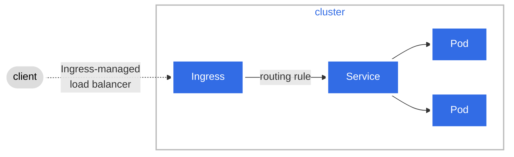

# Kubernetes

是一个开源的容器编排平台

Kubernetes is an open source container orchestration engine for automating deployment, scaling, and management of containerized applications.


## 组件

Control Plane Components 通常只在master上运行

Node components 是每个节点上都需要有的

### 控制面板组件 Control Plane Components

大脑，不干活儿（不负责开pod...），只管“想、安排、纠错”

- 我现在集群里**应该**是什么状态
- 实际是不是这个状态
- 不一样能怎么修正

| 组件                     | 职责                                   |
| ------------------------ | -------------------------------------- |
| kube-apiserver           | 对外接口、唯一入口                     |
| etcd                     | 存所有状态数据，只和api sercer直接通信 |
| kube-scheduler           | 给pod分配node                          |
| kube-controller-manager  | 保证达到用户期望的状态                 |
| cloud-controller-manager | 对接云厂商                             |

#### kube-apiserver

可以运行多个实例，可被scale

k8s所有操作的唯一入口，包括`kubectl apply -f xxx.yaml`等待，都是先经过api server，❗ 把数据存到etcd；相当于提供了一个服务端的api接口，用户做的操作本质上是调这个接口，再通知相应的组件做事

别的组件都是watch api server，接收新的“工作”


#### etcd

集群数据（键值对）

不是k8s自己开发的组件，是一个开源的分布式存储系统，k8s只是集成和使用etcd，依赖它存储集群的所有状态，相当于“数据库”

- pod, service, deplyment, node...资源对象
- configmap, secret...对象信息
- 集群当前的实际状态和期望状态

api server是唯一和etcd通信的组件，其他组件都需要通过api server间接访问etcd


#### kube-scheduler

watch api server，给没被分配node的pod，分配一个适合的节点

- 发现 pod.spec.nodeName = null

- 从所有的node里挑一个最适合的，决策因素：individual and collective [resource](https://kubernetes.io/docs/reference/glossary/?all=true#term-infrastructure-resource) requirements, hardware/software/policy constraints, affinity and anti-affinity specifications, data locality, inter-workload interference, and deadlines

- 给pod绑定nodeName


#### kube-controller-manager

运行各种控制器，将集群的实际状态调整为用户声明的期望状态

##### 【先了解一下】控制器

```
if (actualStatus !== desiredStatus) {
	修正
}
```

例如：

Deloyment中的 replicas: 3，但实际只scale了两个pod，相应的controller发现pod的数量不一致，就会创建一个新的pod

常见的控制器

| 控制器                                                       | 做的事情                                               |
| ------------------------------------------------------------ | ------------------------------------------------------ |
| Node controller                                              | node掉线就标记 NotReady                                |
| Job controller                                               | 管理job，确保任务完成一次或按计划执行                  |
| EndpointSlice controller【文档里写的，没理解，应该和kind有关】 | 填充EndpointSlice对象（提供服务和pod之间的链接）       |
| ServiceAccount controller【文档里写的，没理解，应该和kind有关】 | 为每个 namespace 自动创建默认的 ServiceAccount         |
| Namespace Controller                                         | 处理每个ns的生命周期，比如删除ns时需要清理其中所有资源 |
| DaemonSet Controller                                         | 确保每个节点上都运行一个pod                            |
| ...                                                          |                                                        |

**每一个 controller 都是一个“死循环”**

1. 从api server获取当前集群状态
2. 与用户通过yaml or cli发出命令的期望状态比较
3. 如果不一致，就调用 apiserver 发起变更（如创建/删除pod）
4. 不断重复

---

kube-controller-manager就是把这些contoller打包在一起运行，本身不做任何业务逻辑，支持协调作用

- 所有的控制器都watch api server

- 不直接操作etcd，所有的数据读写都经过api server

- 与kube-scheduler同级、并行，scheduler负责给pod分配节点，controller-manage负责确保pod的数量等到达用户的预期

  > 比如replicas = 3，但实际0个pod，controller就会创建3个pod对象，即使pod.spec.nodeName = null，status是pending也没关系，因为对象已经存在里，下一次controller loop看到了有三个pod对象，就不会再创建pod了
  >
  > scheduler会来找pod.spec.nodeName = null的pod，给它分node

#### cloud-controller-manager

k8s要支持各种云环境，把和云相关的controller剥离出来，只有在使用云平台的时候需要

类似于云环境的插件，把k8s的核心controller和云厂商的逻辑解耦

和kube-controller-manager都是通过api server监听和修改资源，**彼此独立，互不包含**

云平台上的负载均衡


### 节点组件 Node components

运行在每一个节点上，真正负责运行pod，维护容器生命周期，提供网络能力...真正干活儿的

| 组件              | 职责                |
| ----------------- | ------------------- |
| kubelet           | 真正创建/管理pod    |
| Container Runtime | 真正创建/管理容器   |
| kube-proxy        | 配置service转发规则 |

#### kubelet

实际负责创建pod，把pod.spec变成运行的容器，但他实际把pod堪称一个“沙盒”，里面用来装容器的，kubelet创的是这个沙盒，containerd创的是里面的容器

- watch api server，拉取pod.spec.nodeName == 本节点（scheduler绑的）的 pod spec

- 在本机创建、启动、停止、销毁容器（❗ **通过CRI调用container runtime去做和容器相关的操作**）

  > 如解析spec后，发现要开启一个nginx:latest的容器，调CRI接口
  >
  > 1. imageService.pull("nginx:lastest")
  > 2. runTimeService.createContainer("...")
  > 3. runTimeService.startContainer("...")

- 监控容器状态，对比期望状态，如果与期望不一致就会尝试重建等操作

- 确保pod中的容器按spec定义时运行，执行监控检查probe

- 根据容器状态计算整个pod的状态

- 上报pod.status给api server，调类似于 Patch /api/v1/namespaces/{ns}/pods/{name}/status 的接口，会被校验权限，只允许改status

- 挂载volume等额外工作

>如果 pod Not Ready，controller不会有动作，因为副本没有减少；但EndpointSlice controller会watch到以后把Not Ready的pod从EndpointSlice中移除，流量不会被分配给这个pod
>
>如果 pod failed，controller可能会新建（受控的pod，如deployment的scale），对于散装的pod没人记得

---

【题外话】pod的相关字段谁能改

- metadata：api server
- spec：用户、scheduler
- status：kubelet


#### Container runtime

接收kubelet的CRI调用，并提供服务

调用底层创建真正的容器（cgroup隔离）

```bash
# 查看containerd中的容器
sudo crictl ps

# 查看容器日志 jcjy-chenqi-test
# kube-apiserver
sudo crictl logs -f dde670b7b8092

# kube-scheduler
sudo crictl logs -f fceac6f397e56

# kube-controller-manager
sudo crictl logs -f f34078495f939

# kube-proxy
sudo crictl logs -f d5a4793b8bf8b
```


#### kube-proxy

##### 【先了解一下】service

pod的IP是临时的，状态是不稳定的（重建、变多变少...），如果直接连pod IP，pod一变所有的客户端都会挂

引入service，给一组不断变化的pod，提供一个稳定的访问入口

---

kube-proxy 把 service --> pod 这个抽象的概念，变成真实的网络转发规则（iptables/ipvs <-- 这个不懂，应该和决定转发到哪个pod有关，有些算法来做决策）

iptables：https://www.bilibili.com/video/BV1Jz4y1u7Lz

> 映射作用：把service的地址，映射到一组pod地址中（EndpointSlice）

watch两类对象

- service：有哪些服务，端口是多少
- EndpointSlice（可用的pod列表，Ready的pod才在里面）：哪些pod是可以被这个service转发的


看起来和nginx概念很像，对外提供一个固定的入口，实际背后有很多台服务器，会用合适的办法分发请求

kube-proxy只是配置了一套规则，后续的路由和传输靠的是CNI网络插件（实际是linux内核网络机制 <-- 不懂），不经过kube-proxy进程


## kind

k8s定义的资源类型，每个yaml里都有

```
kind: Pod / Deployment / ...
```

每种kind对应一个api resource，由特定的controller管理

用户通过声明kind+spec声明期望状态，由k8s的组件变为实际状态

### Workload

#### Pod

k8s里最小的调度单元

一个或多个耦合**容器**的逻辑组（沙盒or运行环境），共享网络、存储等资源

特性：

- 一次性Ephemeral：IP、主机名...在重建后都会变

- 调度原子性：pod 是kube-scheduler分配到node的最小单位，在同一个pod下开启的container，一定会被分配在同一个node上

  > 调度的执行者是kube-scheduler
  >
  > “原子” = 不可再分的最小操作单元

- 不会自愈：裸 Pod 被删除后不会自动重建（需controller管理）

TODO: √ 

一个pod里container的ip地址是不是一样的

两个container怎么互相访问

##### container

网络共享（所有容器共享同一个网络命名空间）

- 拥有唯一的pod IP

- 容器间可通过`localhost:<port>`直接通信

  > 容器 A 监听 0.0.0.0:8080，容器 B 可通过 `curl http://localhost:8080` 访问其服务

存储共享

- 容器可通过挂载相同的 Volume共享文件或数据
- 常用方案
  - emptyDir：临时共享卷，生命周期与pod一致，适用于sidecar 模式、日志中转等场景
  - pv+pvc：用于需要跨pod重建持久化的数据（如数据库、用户上传文件）

生命周期 

- 整体生命周期：pod内所有容器作为一个整体被创建、启动、终止或销毁
  - pod删除 --> 所有容器同步终止
  - node故障 --> 整个pod（含所有容器）被视为失败
- 独立容器状态：每个容器都有独立状态waiting, running, terminated
- 聚合pod状态：pod的phase(running, failed)由所有容器状态共同决定
  - running：至少由一个容器正在运行，其余已成功启动
  - failed：所有容器已终止，且至少一个因错误退出
- 容器可独立重启（如因liveness probe失败），但pod的监控状态反应的是全局结果


#### pod内部机制

##### Init Containers

k8s pod中一种特殊的容器类型，在app containers启动前运行，必须执行成功exit 0后，主容器才会启动

> 很像pod启动前的准备工作脚本，但以容器的形式运行，有独立的镜像、命令和权限

与普通容器的区别

- init container一定要运行完成exit 0（一次性任务） 【app controller是长期运行的】

- 串行执行：下一个容器启动前，上一个init container一定要执行完成（一个接一个）【多个app controller可并行启动】

- 如果pod init container启动失败，k8s会反复重启这个init container，直到成功；但如果配了restartPolicy:never，且运行失败了，k8s会将整个pod视为失败

  > 传统init container的restartPolicy默认是OnFailure

- 不支持lifecycle、livenessProbe等，不需要探针；因为它是个任务，不是服务；要么成功要么失败重试，不需要健康检查

---

v1.28+起有了原生sidecar container（通过init containers + restartPolicy: Always实现）

- 在pod的启动阶段像init container一样先运行（阻塞app container启动）
- exit 0后，kubelet自动将其转为长期运行的容器，行为上等同于sidecar

v1.29+进一步优化

- 即使不退出，kubelet也会在适当的时候启动主容器，不会强制要求先exit 0（kubelet做的事情是跳过了“必须 exit 0”的限制）
- 容器状态从 `.status.initContainerStatuses` 移到 `.status.containerStatuses`

使用init container的原因：

- init container可以包含app container中没有的工具，如果至少启动前需要执行的一些操作，不用为了加一个工具来重新构建整个主镜像，如curl, git, jq等

- 开发运维解耦，开发者关注app container业务逻辑；运维可以通过init container注入环境特定的密钥、注册服务等

- init container可以访问app container不能访问的敏感信息，让init container挂载某个secret（mountPath），去获取配置或证书，生成一个config.json再通过emptyDir共享给app container

  > 要求幂等性（尤其是对emptyDir的写入）：首次启动emptyDir中是空的，init container可顺利写入；若pod重启后，所有的init container会再执行一遍，但此时emptyDir中已有内容，脚本应能处理这种情况

- **确保依赖就绪**，阻塞app container启动，知道条件满足，等待数据库、redis、rabbitmq等中间件服务可用，再起app container

  > pod status为pending，且initialized: false

- 减少app container的供给面，如不在app container中按照 curl, bash, netcat等，提升安全

字段限制与更新行为：

- init container名字必须唯一

- 修改init container镜像 !== 重启pod，正在运行的pod不会重启，在创建新pod时会使用新镜像

资源请求与调度：

- k8s按以下规则计算pod的有效资源请求/限制

| 资源类型     | 有效值 = max( )                                              |
| ------------ | ------------------------------------------------------------ |
| CPU / Memory | max( 所有 Init Container 的 request, 所有 App Container 的 总和 request ) |

比如：

```
initContainers:
  - name: init1
    resources:
      requests: { memory: "200Mi" }
  - name: init2
    resources:
      requests: { memory: "300Mi" }   # ← 最大 Init 请求 = 300Mi

containers:
  - name: app1
    resources:
      requests: { memory: "400Mi" }
  - name: app2
    resources:
      requests: { memory: "100Mi" }   # ← App 总和 = 500Mi
```

pod 的有效内存请求 = max(300Mi, 500Mi) = 500Mi

- 调度基于”有效请求“：kube-scheduler用500Mi来判断节点是否有足够资源

activeDeadlineSeconds 设置超时，防止无限等待

- 对pod的整个生命周期生效
- 即使init成功、主容器正常运行，到时候也会被强制杀死
- job/cron job使用，deployment/statefulSet不要用，否则服务会突然被kill


##### sideCar

与主应用容器运行在同一个 Pod 中的辅助容器，用于提供日志、监控、安全、网络代理等能力，而不修改主应用代码

同生命周期：与主容器一起启动、一起终止（Pod 级生命周期）

共享资源：共享网络（localhost 可通）、存储卷（如 emptyDir）、IPC 等

权责分离：主容器专注业务逻辑，Sidecar 专注基础设施功能

解耦增强：无需改动主应用，即可注入需附属的新能力

网络服务proxy、日志收集、数据同步...

```
initContainers:
  - name: logging-agent
    image: fluentd
    restartPolicy: Always # 重点
```

启动阶段：Sidecar = Init Container + restartPolicy: Always改动后，可以确保启动顺序，sidecar先于主容器启动；且支持所有的探针，等所有的容器（包括sidecar container）都Ready后，pod才会ready，才可被service转发流量

终止阶段：sidecar最后退出，且按反序关闭（先关app container，再关后定义的sidecar，再关先定义的sidecar）

> 当 Pod 被删除时，kubelet会向所有容器发送SIGTERM，主容器先关闭，sidecar排在后面，可能来不及在terminationGracePeriodSeconds的时间里优雅退出，就被SIGKILL掉（非0退出码）

比如：

```
initContainers:
  - name: wait-db          # 常规 Init：必须 exit 0
    image: busybox
    command: [sh, -c, 'until nc -z mydb 5432; do sleep 1; done']

  - name: envoy-proxy      # Sidecar：restartPolicy: Always
    image: envoyproxy/envoy
    restartPolicy: Always   # ← Sidecar！

  - name: config-watcher   # 另一个常规 Init
    image: alpine
    command: [sh, -c, 'wget -O /shared/config.yaml http://config-server']
```

✅ 执行顺序：

1. wait-db 运行 --> 等 DB 就绪 --> exit 0
2. envoy-proxy 启动 --> 进入 Running --> kubelet **不等它退出**，直接启动config-watcher
3. config-watcher 运行 --> 下载配置 --> exit 0
4. 所有 Init 完成 --> 启动主应用容器
5. 此时：**主容器 + envoy-proxy（Sidecar）同时运行**。

###### Sidecar 与 Job 的特殊行为

job 的完成条件：只要 `.spec.template.spec.containers` 中的主容器成功退出（exit 0），job 就算完成

k8s特意设计，sidecar（即使还在运行）不会阻止 job 完成，否则sidecar 会永远卡住job

如一个备份job，在备份执行完成后exit 0，job立刻标记为Complated；即使s3-async的sidecar还在监听新文件上传，job也无需等待

###### C.f. sidecare & init container

| 对比维度     | Init 容器（传统）                             | Sidecar 容器（新型 Init）                       |
| ------------ | --------------------------------------------- | ----------------------------------------------- |
| 运行时机     | 必须在主容器启动前完成（exit 0）              | 启动后持续运行，与主容器并发                    |
| 是否长期运行 | ❌ 一次性任务                                  | ✅ 持续运行直到 Pod 终止                         |
| 支持探针     | ❌ 不支持 `readinessProbe` / `livenessProbe`   | ✅ 支持所有探针                                  |
| 数据交互     | 单向：只能通过共享卷（如 `emptyDir`）写入数据 | 双向：可通过 localhost 网络 + 共享卷实时通信    |
| 典型用途     | 等待依赖、下载配置、生成证书                  | 日志收集、服务代理、指标暴露、证书轮换          |
| 定义位置     | `spec.initContainers`                         | `spec.initContainers` + `restartPolicy: Always` |


### Workload Management

#### Deployment

部署无状态服务（Web 服务器、API 等）

无状态意味着：pod可以随时被替换（IP，主机名都可变）、不依赖本地存储、多个副本行为完全对等

> 无状态服务：任何一次请求都不依赖于之前的请求或本地存储的数据，如任意RESTful API
>
> 有状态服务例子：mysql，postgres，redis...

为pod和ReplicaSet提供声明式服务，只要给deployment的声明，k8s自动达成；而非手动scale, set image等（命令式）

核心能力

- 副本控制：定义和管理应用程序的副本数量，比如定义一个应用程序副本数量为 3，当其中一个发生故障时，就会生成一个新的副本来替换坏副本，始终保持有 3 个副本在集群中运行
- 滚动更新（Rolling Update）：定义和管理应用程序的更新策略，使用新版本替换旧版本，确保应用程序的平滑升级（不对用户的使用造成中断或不便的升级）
- 回滚（rollout undo）：升级出问题，能一键回滚到旧版本，版本回溯

一个控制器很难同时做好这些事情，所以k8s用了分层设计

1. ReplicaSet

   ❗ 确保有指定数量的**相同pod**一直在运行

   只认pod的当前模板，挂了就重建一模一样的

   > 副本控制器，没有版本概念

2. Deployment

   不直接管理pod，而是管理多个ReplicaSet

​	❗ 修改Deployment的template，会创建一个新的ReplicaSet（对应新的template），逐步减少旧ReplicaSet的副本数，逐步新增新ReplicaSet的副本数，最终把旧ReplicaSet的副本数缩容到0（但保留记录，用于回滚）

---

初始状态：

```
Deployment (nginx:1.20)
└── ReplicaSet-v1 (replicas=3)
    ├── Pod-1 (nginx:1.20)
    ├── Pod-2 (nginx:1.20)
    └── Pod-3 (nginx:1.20)
```

执行了`kubectl set image deployment/web nginx=nginx:1.21`

Deployment开始工作：

```
Deployment 
├── ReplicaSet-v1 (replicas=2)  ← 逐步缩容
│   ├── Pod-1
│   └── Pod-2
└── ReplicaSet-v2 (replicas=1)  ← 逐步扩容
    └── Pod-4 (nginx:1.21)
```

最终状态：

```
Deployment 
├── ReplicaSet-v1 (replicas=0)  ← 保留！用于回滚
└── ReplicaSet-v2 (replicas=3)
    ├── Pod-4
    ├── Pod-5
    └── Pod-6
```

❗ 且回滚很快，因为不需要重新解析yaml或者pull旧的镜像，ReplicaSet是直接存在的，直接扩容即可


#### ReplicaSet

确保指定数量的 pod 副本运行，只管数量，不管版本更新

**不直接使用**：通常由 Deployment 自动创建

如果手动创建ReplicaSet，也能工作，但无法滚动更新（因为版本是Deployment控制的）

```
apiVersion: apps/v1
kind: Deployment
spec:
  replicas: 3
...
```


#### StatefulSet

pod不是一次性的

运行“有状态应用”的控制器，给每个pod分配一个identify，即使被重建，身份也不会丢，网络地址、绑定的磁盘永久属于它

**guarantees**

1. 稳定的唯一网络表示（Stable Network Identify）

   - pod的名字是固定的：`<statefulset-name>-0`, ..., `<statefulset-name>-N-1`

   - 每个pod有固定的 DNS 名称：

     规则：`<pod-name>.<headless-service-name>.<namespace>.svc.cluster.local`
     
     > DNS name是集群内自动为资源生成的可解析的域名，使得应用之间可以通过名字而非IP地址通信
     >
     > ！！一定要是无头service，clusterIP: None
     >
     > 有头服务会生成一个虚拟的cluster IP，流量先到cluster IP再由kube-proxy转发到pod
     >
     > 无头服务没有cluster IP，DNS直接返回pod真实的IP，不经过中间代理，程序可以通过命名规则指定需要访问哪个pod

   ```
   mysql-0.mysql.default.svc.cluster.local → 固定指向 mysql-0
   mysql-1.mysql.default.svc.cluster.local → 固定指向 mysql-1
   ```

   > ❗ mysql主库能读写，从库只能读，这个场景下就需要分清是master还是slave
   >
   > kafka的分片也是需要分辨的，需要确认是第一分片还是第二分片

   - 即使 Pod 被删掉重建，名字和 DNS 不变

2. 稳定的持久化存储（Stable Persistent Storage）数据不会丢

   - 不使用现成的PVC，而是定义一个volumeClaimTemplate的列表（pvc的模板）

   - k8s会为每个pod自动生成一个专属的pvc，生成的pvc也有自己的命名规范 `<volumeName>-<statefulSetName>-<ordinal>`，pod实际使用的是pvc对应的pv（如果一块云盘，或者存储空间）

   - 如果pod在节点宕机，k8s要在另一个node上重建，默认pvc不随pod删除（pv也存在），新的mysql-0 pod启用的时候，pvc的名字也是固定的，k8s发现这个pvc已经绑定了一个pv，就自动将原来的pv挂载到pod上了

     > 无论pod在哪个节点上跑，用的始终是同一份数据

3. 有序部署和扩缩容（Ordered, graceful deployment and scaling）

​	启动顺序：0 --> 1 --> 2（等前一个ready再继续）

​	删除顺序：2 --> 1 --> 0

​	扩容：先创建 pod-2，等它ready再继续

> 只提供基础设施层面的有序性，应用业务逻辑的顺序可以由init container介入

4. 有序滚动更新（Ordered, automated rolling updates）

   默认：RollingUpdate

   倒序更新，因为序号小的往往是主节点，由序号最大的pod开始更新，会更安全；且等该pod稳定ready的时候再动下一个

   支持Partitioned Rolling Update，分阶段上线，暂时有一部分的pod不升级


### Services, Load Balancing, and Networking

#### Service

pod是临时的（ephemeral），会被创建、销毁、替换，IP地址不固定；前端应用要调用后端pod，不能直接依赖pod IP（因为会变）

Service是为了解决这个问题↑，设计的抽象层，是为一组pod提供一个稳定的网络端点（IP+port），即使背后的pod不断变化，客户端也可以通过同一个地址访问服务

> 解耦客户端与后端pod
>
> k8s自动维护service与pod的映射关系，实际上是用EnpointSlice维护的

##### Defining a Service关联endpoints

###### 通过Label Selector关联pod

> 最常见的方式，pod的labels里会有相应的app.kubernetes.io/name

```yaml
spec:
  selector:
    app.kubernetes.io/name: MyApp
```

###### 【多了解一下】EndpointSlice

endpoint-slice-controller这个控制器会持续扫描匹配的pod

- 监听serivce和pod的变化（特别是与service select匹配的pod）

- 为每个service自动生成和维护对应的EndpointSlice对象

- 确保EndpointSlice中endpoint列表与实际匹配的pod集合保持一致（IP、端口、就绪状态、拓扑信息...）

  > 服务拓扑感知：serivce在转发流量的时候，能优先选择拓扑位置更新的pod，从而减少网络延迟、跨区域带宽成本，提升性能
  >
  > 系统会优先选择同节点node上的pod
  >
  > --> 若没有，则选择同可用区zone的pod
  >
  > --> 再没有才选其他区域的pod
  >
  > 
  >
  > k8s通过EndpointSlice中的topology字段来记录每个enpoint的拓扑位置
  >
  > kube-proxy可以读取这些拓扑信息，在做负载均衡时实现“就近转发“

  ```yaml
  endpoints:
  - addresses:
    - "10.244.1.5"
    conditions:
      ready: true
    topology:
      kubernetes.io/hostname: node-1
      topology.kubernetes.io/zone: zone-a
      topology.kubernetes.io/region: us-west
  ```

- 清理不再需要的EndpointSlice（service被删除时...等情况下）

> 旧版的Endpoints API是单对象模型，每个service只对应一个Endpoints对象
>
> 当后端pod数量巨大，这个Endpoints对象也会很大，占用大量etcd存储，且每次pod变化都要全量更新整个对象，影响kube-proxy等组件的性能，为了避免系统崩溃，k8s硬性限制：一个Endpoints对象最多包含1000个enpoint条目，超过1000个会随机选择最多1000个pod写入，并给Endpoints打上注解，pod<1000时再移除注解
>
> 💡但！EndpointSlice不受这个限制，因为它是分片的，每个slice默认100个endpoint（可在controller里调整参数--max-endpoints-per-slice），可无限扩展（每个EndpointSlice通过label与service关联）

---

kube-proxy消费EndpointSlice中的数据，构建本地的网络转发规则（iptables），不负责创建或更新EndpointSlice

Port definitions 可以用targetPort把pod的端口绑到service上

```yaml
apiVersion: v1
kind: Service
metadata:
  name: nginx-service
spec:
  selector:
    app.kubernetes.io/name: proxy
  ports:
  - name: name-of-service-port
    protocol: TCP
    port: 80
    targetPort: http-web-svc 

---
apiVersion: v1
kind: Pod
metadata:
  name: nginx
  labels:
    app.kubernetes.io/name: proxy
spec:
  containers:
  - name: nginx
    image: nginx:stable
    ports:
      - containerPort: 80
        name: http-web-svc
```

###### Services without selectors

当你想暴露集群外部的服务（如数据库）或跨命名空间/跨集群服务时，可以不设 selector

> ❗ 数据库的端口不是10.xxx.xxx.xxx，是192.168.xxx.xxx

就创建一个无selector的service

```yaml
apiVersion: v1
kind: Service
metadata:
  name: external-mysql
spec:
  ports:
    - port: 3306
      targetPort: 3306
```

需要手动创建EndpointSlice来指定后端地址

```yaml
apiVersion: discovery.k8s.io/v1
kind: EndpointSlice
metadata:
  name: external-mysql-1
  labels:
    kubernetes.io/service-name: external-mysql  # 匹配service的名称
endpoints:
  - addresses: ["192.168.1.96"]
ports:
  - port: 3306
```

但 kubectl port-forword service/xxx 会失效

因为k8s在执行port-forward的时候会检查这个service是否有selector，如果没有则检查其endpoints是否只想集群内部的pod（owner reference或pod IP验证），防止越权访问

###### ExternalName

是另一种无selector的service，但它完全不用EndpointSlice

作用：把一个k8s内部的service 名称（DNS 名）映射到一个外部的 DNS 域名

不提供cluster IP，不创建endpoint，也不经过kube-proxy转发流量，只是让集群内的 Pod 能通过一个“本地名字”访问外部服务，就像访问集群内服务一样

```yaml
apiVersion: v1
kind: Service
metadata:
  name: my-external-db      # 在集群内使用的名称
spec:
  type: ExternalName        # ← 关键：指定类型为 ExternalName
  externalName: prod-postgres.corp.example.com  # ← 外部的真实域名
  ports:
    - port: 5432            # 可选，仅用于文档或工具提示（实际不生效）
```

k8s默认使用CoreDNS作为内部DNS服务器，当创建ExternalName service之后，CoreDNS会自动生成一条CNAME记录

```
my-db.default.svc.cluster.local.  IN  CNAME  prod-postgres.corp.example.com.
```

pod 查询 `my-db` --> CoreDNS 返回 CNAME --> 客户端解析 `prod-postgres.corp.example.com` --> 得到真实 IP

💡externalName一定要是合法域名，如果要只想IP，应该使用无seletor service+手动EndpointSlice


##### Service Type

###### ClusterIP

是k8s service中的默认类型，为service分配一个仅在集群内部可达的虚拟IP地址，这个IP不能从集群外部直接访问

当创建一个ClusterIP类型的service时

- 从集群预设的service-cluster-ip-range（比如10.96.0.0/12）中分配一个IP

- 在所有节点上通过kube-proxy设置iptables规则

- 将发往该ClusterIP+port的流量负载均衡转发到匹配的pod（根据selector）

  > 负载均衡是kube-proxy控制的

可以手动指定clusterIP，但需要属于--service-cluster-ip-range配置的网段，且若被其他service占用会创建失败，一般不建议手动指定


###### NodePort

NodePort是在ClusterIP的基础上扩展而来的一种service类型

它会在集群的每一个节点（Node）上开放一个固定的端口（比如30007），外部用户可以通过任意节点的 IP + 这个端口来访问服务。

> NodePort = ClusterIP + 在每个node上暴露一个端口

❗ 比如创建了一个service，分配到30007端口，那么

node1:30007, node2:30007, node3:30007, ... 都能访问同一个服务，这个端口号对整个service是全局唯一的、固定的

用户请求到某个节点（k8s不参与选节点，是客户端or外部负载均衡器的责任）

1. 用户知道有几个节点，手动指定IP
2. 在云上或者硬件LB配置一个VIP，后端指向所有node的30007，用户访问`http://<LB-VIP>:30007`，外部LB会决定把流量分给node1、node2、...

---

若未指定nodePort，k8s会从默认端口范围（30000-32767）中随机挑选一个可用端口；若指定了，k8s会尝试使用你指定的端口（前提是未被占用且在范围内）

Kubernetes 将 NodePort 范围分为两个区段来降低冲突概率：

- 静态区（Static band）：30000–30085 --> 推荐用于手动指定
- 动态区（Dynamic band）：30086–32767 --> 自动分配优先使用这里


###### LoadBalancer

为云环境设计的对外暴露方式，做外部统一入口

将service的type设置为LoadBalancer时，k8s会请求云平台（aws，aliyun等）自动创建一个外部负载均衡器

这个负载均衡会获得一个公网IP，外部用户能通过这个IP访问到服务

> LoadBalancer = NodePort + ClusterIP + 云厂商自动创建的外部LB

创建了一个 type: LoadBalancer 的service

- cloud-controller-manager检测到这个请求
- 调用云平台API，创建一个真实的负载均衡器实例 | 调用本地负载均衡的插件
- 同时k8s内部仍然会创建一个nodePort和clusterIP（底层复用NodePort机制）
- 云负载均衡器被配置为：监听IP+端口，将流量转发到集群所有节点的NodePort（比如30007）
- 节点上的kube-proxy再把流量转发给后端pod

> ClusterIP  ⊂  NodePort  ⊂  LoadBalancer

```
用户浏览器
    │
    ↓
访问 http://203.0.113.10 （AWS ELB 的公网 IP）
    │
    ↓
AWS ELB（外部负载均衡器）
    │
    ↓
将流量分发到任意一个 EC2 节点的 NodePort（如 :30007）
    │
    ↓
该节点上的 kube-proxy
    │
    ↓
转发到匹配的 Pod（可能在本节点，也可能跨节点）
```

用户只需记住一个 IP（或绑定 DNS 域名），高可用、健康检查、自动扩缩容都由云 LB 处理


###### ExternalName

一种特殊类型的service，它不代理流量到任何pod

在 Kubernetes 集群内部创建一个 DNS 别名（CNAME），指向一个外部的**域名**（比如 `api.example.com`、`my-db.rds.amazonaws.com` 等）。

> ExternalName = 纯 DNS 映射，无网络代理、无负载均衡、无后端 Pod
>
> 懒得写那么长的域名了，给它起个代号

❗ 上面definning a service中写过ExternalName了


##### Headless Service

没有Cluster IP的service，不会被kube-proxy处理，不会提供负载均衡or代理，不会通过VIP转发流量

可以让用户直接访问真实的pod IP，通过DNS返回所有pod的A/AAA记录（有头的返回的是cluster IP）

```
spec:
  clusterIP: None 
```

###### 有selector的Headless Service

会自动创建EndpointSlice

###### 无selector的Headless Service

需要手动创建EndpointSlice

❗ 以上 StatefulSet 里写得挺清楚了

**StatefulSet + Headless Service** 的核心机制：每个 Pod 有唯一、稳定的 DNS 名称


##### Virtual IP Addressing Mechanism

k8s service能工作的核心底层原理

iptables【TODO】


##### Traffic Policies

控制流量如何路由到后端pod

1. .spec.externalTrafficPolicy

   控制从集群外部进入的流量（如 NodePort、LoadBalancer）如何转发

   - Cluster（默认）：流量可转发到**任意节点**上的 pod（可能跨节点跳转）
   - Local：只能转发到本节点上的pod

默认情况下，为了确保回程流量能正确返回，kube-proxy会

- 把请求的目的地改成pod IP（DNAT）
- 同时把源IP改成node1的IP（SNAT）

```
原始请求：  Client(1.2.3.4) → node1:30080
转发后：    Client 的包变成 → 源IP=node1, 目标IP=Pod-on-node2
```

pod看到的源 IP 是node，**不是真实的客户端 IP（1.2.3.4）**，无法做 IP 黑名单、地域分析、审计等


#### Ingress

管理从集群外部到集群内部服务的http(s)流量路由

> 只支持HTTP(S)协议，如果要暴露TCP或其他协议，需要用NodePort或LoadBalancer类的service

> 官方最新立场：推荐使用 Gateway API，不再开发 Ingress



ingress本身不是负载均衡器，而是一个配置规则；真正做负载均衡的是ingress controller（如nginx ingress controller），会根据ingress资源定义的规则来选择路由做转发

用户访问某一个域名或路径，ingress controller根据ingress的规则将请求转发到对应的service（通常直接访问service的clusterIP，或直接通过endpoint访问pod，而不是经过nodeport）

> ingress的流量一般不走nodeport，ingress controller不需要依赖nodeport来访问后端服务

###### 一些规则

基于域名路由、基于路径路由

- 每个path必须指定pathType：Exact完全匹配、Prefix前缀匹配、ImplementationSpecific由controller自定义（不推荐），否则创建失败
- ingressClassName：指定使用哪个ingress controller，该名称对应一个ingressClass对象
- 若请求不匹配任何规则，可由spec.defaultBackend指定兜底服务


###### ingress controller

ingress controller（如nginx ingress controller）本身是一个运行在pod中的应用，当它需要把请求转发到service-a时

- 直接使用service的clusterIP

  - 通过DNS解析service-a.namespace.svc.cluster.local得到cluster IP
  - 发送HTTP请求到该cluster IP
  - 流量进入kube-proxy的iptables规则，将请求负载均衡到service-a对应的pod enpoint中

- watch endpoints（或endpointSlices对象），绕过sevice，直连pod endpoint（service-upstream: false 是默认值）

  - 跳过kube-proxy转发，降低延迟

  - nginx可以自己做轮询、权重、健康检查等负载均衡（无状态的负载均衡行为，pod是可替代的）

    > C.f. statusfulSet直连是为了强调pod的身份唯一性

  - 依赖endpointSlice的及时更新

ingress controller只关心service的selector对应的endpoints（pod list），无论是哪个type的service，只要selector能匹配到pod，ingress就能正常工作，因为ingress controller是集群内部的组件


###### 流量入口

用户访问的url不是”直接“到ingress controller的，中间也经过一个entry point，如云厂商的load balancer、nodeport等

ingress controller本身只是一个pod，它也需要被暴露出来，才能接收外部的流量

1. 用户发起请求，DNS解析得到一个公网IP

   > 这个IP不是ingress controller的pod IP，而是ingress controller被暴露出来的入口IP

2. 流量到达k8s集群的入口

   1. LoadBalancer类型service（云环境最常见）

      - 云平台会创建一个负载均衡器LB
      - 用户DNS指向这个LB的公网IP
      - LB把流量转发到集群中运行ingress controller pod的节点（nodeport或直接到pod，取决于实现）
      - 最终到达ingress controller pod

   2. NodePort类型service

      - 用户访问http://<公网节点IP>:xxxx
      - 流量到达该节点，kube-proxy转发到ingress controller pod

   3. HostNetwork: true + DaemonSet

      ```
      apiVersion: apps/v1
      kind: DaemonSet
      spec:
        template:
          spec:
            hostNetwork: true   # ← Pod 直接使用宿主机网络
            containers:
              - name: controller
                ports:
                  - containerPort: 80  # 直接监听主机 80 端口
      ```

      - ingress controller pod 直接绑定到每个节点的80/443 端口

      - 用户 DNS 指向某个节点 IP（或前面加一个外部 L4 LB 做 VIP）

        > 192.168.xx.xx，而非10.xx.xx.xx

      - 流量直接进入 pod，绕过 kube-proxy 和 service

    4. MetalLB

       本地部署，为LoadBalancer service分配一个局域网或公网的IP，效果≈ 云厂商的 LoadBalancer

3. 流量到达ingress controller pod

   - 检查host: xxx.xxx.com

   - 检查路径 /xxx

   - 匹配已加在的ingress资源规则

   - 根据规则，将请求代理proxy_pass到后端对应的service（或直接到pod）

     > 如果没有配置任何规则，就会转发到defaultBackend配置的resource中

###### 为什么LoadBalancer类的service存在，还需要ingress controller

ingress controller 通常就是通过一个 LoadBalancer Service 暴露出去的

不是绕过LB，而是用一个LB服务所有http应用

LoadBalancer Service 是 L4（传输层）的简单暴露方式；Ingress 是 L7（应用层）的智能 HTTP 路由网关。

| 能力             | `LoadBalancer` Service                                | Ingress                                                      |
| ---------------- | ----------------------------------------------------- | ------------------------------------------------------------ |
| 协议支持         | TCP/UDP（L4）                                         | HTTP/HTTPS（L7）                                             |
| 基于域名路由     | ❌ 不支持                                              | ✅ `host: shop.example.com` → service-a ✅ `host: blog.example.com` → service-b |
| 基于路径路由     | ❌ 不支持                                              | ✅ `/api` → backend-api ✅ `/static` → static-files            |
| TLS/SSL 终止     | ⚠️ 部分云厂商支持（需额外配置）                        | ✅ 原生支持（在 Ingress 中声明证书）                          |
| 单 IP 托多个服务 | ❌ 每个 Service 需要一个独立公网 IP                    | ✅ 一个公网 IP + 多个域名/路径 = 多个服务                     |
| 成本             | 💰 每个 Service 一个 LoadBalancer = 多个公网 IP = 贵！ | 💰 一个 Ingress Controller 共享一个 LB = 省钱！               |
| 高级功能         | ❌ 无                                                  | ✅ 重写路径、限流、认证、WAF、金丝雀发布等（取决于 Controller） |

假设有三个服务

方案一：每个都用 LoadBalancer service

```
# shop-svc
type: LoadBalancer → 分配公网 IP A

# blog-svc
type: LoadBalancer → 分配公网 IP B

# api-svc
type: LoadBalancer → 分配公网 IP C
```

需要3个公网IP，DNS分别指向ABC，无法统一TLS证书，云厂商按LB计费（成本高）

方案二：用ingress

```
# 只部署一个 Ingress Controller（1 个 LoadBalancer）
type: LoadBalancer → 公网 IP X

# 三个 Ingress 规则（共享同一个 IP X）
- host: shop.example.com → shop-svc
- host: blog.example.com → blog-svc
- host: api.example.com → api-svc
```

只需一个公网IP，DNS全部指向X，TLS证书在ingress集群中管理，成本低、运维简单


#### Gateway API

通过使用可扩展的、面向角色的、协议感知的配置机制来提供网络服务

- Gateway API 不是一个单一对象，而是一组新的k8s自定义资源（CRDs）
- 它的目标是**取代或增强传统的 Ingress**，提供更强大、灵活、标准化的流量管理能力
- 支持**动态创建负载均衡器、TLS 配置、高级路由规则**等，且**不依赖注解（annotations）**

##### 设计原则

面向角色

| 角色                         | 职责                                                         | 对应 Gateway API 资源    |
| ---------------------------- | ------------------------------------------------------------ | ------------------------ |
| 基础设施提供者 （如云厂商）  | 提供底层网络/负载均衡能力，实现GatewayClass，提供controller  | `GatewayClass`           |
| 集群运维（Cluster Operator） | 管理集群策略、安全、配额，创建Gateway，绑定GatewayClass，监听端口、安全策略（allowedRoutes） | `Gateway`                |
| 应用开发者（App Developer）  | 配置自己的服务如何被访问，域名、路径、header、后端服务、权重... | `HTTPRoute`, `GRPCRoute` |

> 权限分离：开发者不用碰底层 LB 配置，运维也不用管每个应用的路径规则
>
> 只需要知道当用户访问 X 域名 + Y 路径时，请转发到 Z 服务，至于底层网络、安全、IP、负载均衡器……交给平台和云厂商


##### Resource Model

###### Gateway Class

基础设施提供者（aws等）使用，定义一种“网关类型”的模板，告诉k8s他提供一种叫xxx的网关，由他的controller管理

不创建任何实际资源，只是声明存在这一类网关，controllerName是全局唯一的标识符，`aws.gateway.networking.k8s.io`之类的

###### Gateway

集群运维使用，基于某个GatewayClass，创建一个网关实例（如云负载均衡器）

会触发controller创建实际资源，定义监听的端口、用的协议、TLS证书在哪里、谁可以挂路由上来（安全策略）

Gateway的spec.addresses字段可选；如果未指定，controller 会自动分配一个地址（如云 LB 的公网 IP 或集群内 VIP），该地址就是用户访问的入口

```
status:
  addresses:
    - type: IPAddress
      value: 203.0.113.10   # ← controller 填写的，不是 spec
```

默认情况下，gateway只接受来自同一命名空间的路由，跨命名空间路由需要配置allowedRoutes

```
apiVersion: gateway.networking.k8s.io/v1
kind: Gateway
metadata:
  name: prod-web-gw       # ← 实例名（集群内唯一）
spec:
  gatewayClassName: nginx-gc   # ← 引用上面的 GatewayClass
  listeners:
    - name: http
      port: 80
      protocol: HTTP
    - name: https
      port: 443
      protocol: HTTPS
      tls:
        mode: Terminate
        certificateRefs:
          - name: shopco-tls   # ← 引用 Secret
  # 👇 安全策略：只允许特定命名空间挂路由
  allowedRoutes:
    namespaces:       # ← 显式指定 Gateway 所在命名空间（默认是当前命名空间）
      from: Selector
      selector:
        matchLabels:
          env: production
```

###### HTTPRoute

应用开发者使用，想让某个服务通过这个网关暴露出去

通过parentRefs指向一个或多个Gateway

定义域名、路径、后端服务、Header等

```
apiVersion: gateway.networking.k8s.io/v1
kind: HTTPRoute
metadata:
  name: example-httproute
  namespace: frontend-team   # ← 你在 frontend-team 命名空间
spec:
  parentRefs:
    - name: prod-web-gw      # ← 我要挂到这个网关上
      namespace: default     # ← Gateway 所在命名空间
  hostnames:
    - "www.example.com"      # ← 只匹配 Host: www.example.com 的请求
  rules:
    - matches:
        - path:
            type: PathPrefix # ← 路径前缀匹配
            value: /v1       # ← 匹配 /v1, /v1/abc 等
      backendRefs:
        - name: example-svc   # ← 转发到同 namespace 的 example-svc
          port: 8080         # ← Service 的 targetPort
```

当用户访问：GET `https://www.example.com/v1?user=alice` --> 网关会把请求转发给 search-svc:8080

Gateway Controller会检查prod-web-gw是否允许frontend-team命名空间挂载路由，如果允许就把规则加到nginx配置，用户访问时就会转发到相应的search-svc

> 单向引用链：HTTPRoute --> Gateway --> GatewayClass
>
> 权限控制：Gateway中的allowedRoutes决定了哪些HTTPRoute能成功绑定

###### GRPCRoute

应用开发者使用，想让某个gRPC 服务通过网关暴露出去

```
matches:
  - method:
      service: com.example.User
      method: Login
```

GRPCRoute 不仅支持按 host 路由，还能精确到 gRPC 服务名 + 方法名，实现细粒度流量管理（如灰度发布特定 RPC 接口） 

【TODO】我好像不理解什么是GRPC

##### Request flow


1. 客户端准备请求：用户访问 `http://www.example.com`

2. DNS 解析

   - 客户端查询 `www.example.com` 的 DNS 记录

   - 得到Gateway 的入口 IP（由 controller 创建的 LB 或 VIP）

     > 💡 这个 IP 来自 `Gateway.status.addresses`，不是 Service 或 Pod IP

3. 请求到达 Gateway（反向代理）

   - 流量进入 Gateway Controller 管理的代理（如nginx pod）
   - 代理读取 HTTP 请求头中的 `Host: www.example.com`

4. 匹配路由规则

   - 根据 `Host` 头 + 路径（如 `/login`）
   - 查找所有绑定到该 Gateway 的HTTPRoute
   - 找到匹配的HTTPRoute（比如example-httproute）

5. （可选）执行高级处理

   - 如果HTTPRoute定义了 filters，则：
     - 修改请求头（如加 `X-Forwarded-For`）
     - 重写路径
     - 添加认证、限流等

6. 转发到后端 Service

   - 将请求代理到backendRefs指定的service（如 `example-svc:8080`）
   - 实际可能直连endpoint（绕过 kube-proxy），取决于 controller 实现


#### EndpointSlice

#### Network Policies

#### DNS for Services and Pods

#### Service ClusterIP allocation

【TODO ↑】


### Storage

#### Volumes

pod里声明的一块可被挂载的存储**接口**，不是磁盘本身

> 本身不包含数据，只是挂载规则
>
> pod级别，不是容器级别

“我这个pod里，有一块叫x的存储，会被挂到容器的某个路径上”

docker中熟悉的

```
docker run -v /data:/app/data myapp
```

- /app/data：容器里的路径（挂载点）

- /data：外部真实存储（数据源）

- -v：连接关系

k8s把这三件事拆开了

```
spec:
  volumes:                   # ↓↓↓ 第二层：Volume定义
    - name: data             #     (这是"接口"层)
      persistentVolumeClaim:
        claimName: my-pvc    # ↑↑↑ 第三层：数据源
  
  containers:
    - name: app
      volumeMounts:          # ↓↓↓ 第一层：容器需求
        - name: data
          mountPath: /app/data
```

```
volumeMounts（容器需求：挂到哪里）
    ↓
volume（抽象接口：命名连接）
    ↓
persistentVolumeClaim（数据源：从哪里来）
```

设计原因：

- 解耦：容器不需要知道存储细节（是NFS还是云盘），只需知道有个叫`data`的存储可用
- 复用：同一个`volume`可以被多个容器挂载到不同路径
- 可移植：开发环境用hostPath，生产环境用云存储，只需改第三层，不用改容器配置
- 灵活：可以动态替换存储后端而不影响应用


##### Why volumes are important

- Data persistence

  容器中的磁盘文件是ephemeral，容器被销毁后，在生命周期内创建或修改的文件会丢失，kubelet重启后又是干净的磁盘

- Shared storage

  当多个容器在同一个pod内，需要共享文件


##### How volumes work

k8s支持各种卷的类型，比如：emptyDir、hostPath、PersistentVolume（PV）、configMap、secret、云盘（如 AWS EBS）等

一个pod可以同时使用多个不同类型的卷，比如可以挂一个emptyDir用于临时缓存，再挂载一个PersistentVolume存数据库数据

卷分为两类

- Ephemeral临时卷：生命周期与pod绑定，pod被删除时，这类卷也会被自动销毁（emptyDir, configMap...）
- Persistent持久卷：即使pod被删除，数据依然保留

重要❗：无论那种卷，只要pod还在允许，容器重启时卷中的数据不会丢失。卷的核心价值价值之一——解决容器文件系统“临时性”的问题。

卷的本质就是一个**文件夹**，这个文件夹对 Pod 中的所有容器可见，具体怎么创建、在哪里存储、里面有什么内容，都看用的哪个卷类型

比如：

- `emptyDir`：Kubernetes 在节点上创建一个空目录；
- `hostPath`：直接使用宿主机上的某个路径；
- `configMap`：把 ConfigMap 的键值对变成文件放在目录里；
- `PersistentVolume`：可能是网络存储（如 NFS、云硬盘），由集群管理员预先配置好。

> 卷只是个抽象的概念，背后的具体实现由类型决定

如果在pod中使用卷，需要在yaml里做两件事

- 在`.spec.volumes` 中定义卷：告诉k8s要用哪些卷
- 在每个容器的 `.spec.containers[].volumeMounts` 中指定挂载点：告诉容器：“把这个卷挂到我内部的哪个路径”

```
spec:
  volumes:
    - name: my-cache        # 定义一个叫 my-cache 的卷
      emptyDir: {}

  containers:
    - name: app
      image: nginx
      volumeMounts:
        - name: my-cache    # 引用上面定义的卷
          mountPath: /cache # 挂载到容器内的 /cache 目录
```

> 💡**卷是在 Pod 级别定义的，但挂载是在容器级别指定的**，同一个卷可以被多个容器挂载到不同路径

容器启动时的文件系统 = 容器镜像的原始内容 + 挂载的卷

限制1🔒：卷不能挂载到另一个卷的内部，如/app/config和/app/config/logs就不行，要把两个卷挂载到独立的、不互相嵌套的路径/app/config和/app/logs之类的

如果实在需要的话，可以用subPath来处理

```
volumes:
  - name: app-storage
    emptyDir: {}

containers:
  - name: my-app
    image: nginx
    volumeMounts:
      # 把 app-storage 卷的 config/ 子目录挂到 /app/config
      - name: app-storage
        mountPath: /app/config
        subPath: config

      # 把 app-storage 卷的 logs/ 子目录挂到 /app/config/logs
      - name: app-storage
        mountPath: /app/config/logs
        subPath: logs
```

限制2🔒：一个卷中不能包含指向另一个卷的硬链接

###### 补课：硬链接是什么

在 Linux/Unix 系统中，一个文件其实由两部分组成：

1. 数据块（Data Block）：真正存内容的地方（比如你写的文字、代码、图片数据）。
2. **inode**（索引节点）：一个“身份证”，记录了这个文件的权限、大小、创建时间，以及指向哪些数据块。

> 💡 你可以把 inode 想象成“文件的元信息 + 数据指针”。

而我们平时看到的 **文件名**，其实只是一个 **指向 inode 的“标签”**。

硬链接 = 给同一个 inode 再起一个名字（另一个文件名）

> 多个文件名 → 指向同一个 inode → 共享同一份数据
>
> 删除其中一个文件名，只要还有其他硬链接存在，数据不会丢失

例子：

```bash
# 创建一个文件
echo "Hello" > original.txt

# 查看它的 inode 号（假设是 12345）
ls -i original.txt
# 输出：12345 original.txt

# 创建一个硬链接
ln original.txt link.txt

# 再看 inode
ls -i original.txt link.txt
# 输出：
# 12345 original.txt
# 12345 link.txt   ← 完全相同的 inode！
```

硬链接的限制：**只能在同一个文件系统内创建！**

> 因为 inode 是文件系统内部的概念，不同磁盘、不同分区、不同挂载点（比如 `/` 和 `/mnt/nfs`），它们的 inode 编号是独立的，互不相通

如果尝试

```
# /data 来自磁盘A，/backup 来自磁盘B（或 NFS）
ln /data/file.txt /backup/file-link.txt

# 会得到错误
ln: failed to create hard link '/backup/file-link.txt' => '/data/file.txt': 
Invalid cross-device link
```

回到限制2🔒

每个volume可能来自不通的存储后端

- emptyDir：节点本地磁盘
- pv：云盘、NFS、Ceph...

这些 Volume 在容器内表现为不同的挂载点，本质上是不同的文件系统；所以如果在一个卷里试图创建指向另一个卷的硬链接，操作系统会直接拒绝，k8s就会提前拦下来


##### Types of volumes

###### configMap

将配置数据（如 JSON、YAML、环境变量）以文件形式挂载进容器

- 载后是**只读**的
- 如果用 `subPath` 挂单个文件，**不会自动更新**（ConfigMap 更新后容器内看不到）
- 必须先创建 ConfigMap 才能使用

默认行为不用subPath，挂载整个目录

若有pod，容器内/etc/app目录中已有文件

```
/etc/app/
├── main.py
└── config.json   ← 你想用 ConfigMap 替换这个文件
```

不用subPath，直接挂载整个configMap，会导致整个目录被替换

```
volumeMounts:
  - name: config-volume
    mountPath: /etc/app   # 整个目录被替换！
```

结果为↓，原目录内容丢失

```
/etc/app/
└── app.conf   ← 只有 ConfigMap 的内容，main.py 没了！
```

用subPath（只替换config.json）

```
volumeMounts:
  - name: config-volume
    mountPath: /etc/app/config.json   # 注意：这里写完整路径
    subPath: app.conf                 # 指定 Volume 中的哪个 key
```

结果↓，精准替换单个文件

```
/etc/app/
├── main.py        ← 保留！
└── config.json    ← 内容来自 ConfigMap 的 app.conf
```

但使用subPath后，configMap更新后不会同步到容器内

因为使用subPath时，k8s会把volume中的某个文件copy到容器的目标路径（不是bind mount），后续configMap更新，不会触发这个副本更新

---

不用subPath

```
# 在 Node 上，kubelet 创建：
/var/lib/kubelet/pods/xxx/volumes/configmap/app-config/
└── app.conf   ← 实际存储 ConfigMap 数据

# 然后 bind mount 到容器：
容器内 /config/app.conf  →  直接指向上面的文件（或通过 symlink）
```

文件是同一个，更新configMap == 更新源文件 == 容器看到变化

用了subPath

```
# kubelet 先创建 ConfigMap 的完整视图（同上）
/var/lib/kubelet/pods/xxx/volumes/configmap/app-config/app.conf

# 但因为用了 subPath，它执行：
cp /var/lib/kubelet/pods/xxx/volumes/configmap/app-config/app.conf \
   /var/lib/kubelet/pods/xxx/containers/app/xxx/rootfs/app/config.txt

# 然后容器内 /app/config.txt 是一个独立副本！
```

这是一个普通文件拷贝，和 ConfigMap 的源文件断开联系

后续 ConfigMap 更新 → 源文件变了 → 但副本没变


###### emptyDir

是一个临时存储卷，生命周期绑定到pod所在的节点，而不是容器

不是预先存在的存储，而是动态创建的

创建时机：pod被调度到node上，kubelet负责创建这个空目录

> 和node强绑定，不能带到另一台机器上

**用途1：实现同pod多container共享数据**

数据生命周期 = Pod 在 Node 上的存在时间

💡容器崩溃时，数据保留，因为pod还在node上

> 容器异常退出情况：应用代码panic，主进程exit(1)，内存超限被OOMKilled，健康检查失败导致容器重启

```
containers:
  - name: downloader
    volumeMounts:
      - name: shared
        mountPath: /downloads   # 挂到 /downloads

  - name: webserver
    volumeMounts:
      - name: shared
        mountPath: /usr/share/nginx/html  # 挂到另一个路径
```

两个容器操作的是**同一个物理目录**，只是在各自容器内的“视图路径”不同

**用途2：临时工作区**

当内存不够时，程序可以把中间数据写到磁盘

如训练AI模型，每一小时保存一次checkpoint到emptyDir，容器重启后可以从checkpoint继续，而不是从头开始

> 很经典的sidecar container

---

emptyDir.medium控制emptyDir卷存储在哪里，默认情况下存储在该节点的介质上（有可能是磁盘、SSD等，取决于环境）

【TODO: tmpfs】

（内存型）如果将emptyDir.medium设为Memory，k8s会挂载一个tmpfs（基于内存的文件系统）

- tmpfs 是 Linux 的内存文件系统，速度极快
- 但数据只存在于 RAM 中，Node 重启就没了
- 虽然 tmpfs 非常快，但与磁盘不同，写入的文件会**计入容器的内存限制**

> 如果你给容器设了 memory: 512Mi，又用emptyDir.medium: Memory写了 300Mi 文件
>
> 那么应用进程只能用剩下的 212Mi 内存，超了就会 OOMKilled

当默认模式medium: ""（磁盘型）的情况下，可以为默认介质指定大小限制，从而限制emptyDir卷的容量

```
emptyDir:
  sizeLimit: 1Gi
```

存储从node的临时存储（ephemeral storage）中分配，如果该存储已被其他来源（如日志、镜像层）占满，可能写到500Mi就报“No space left on device”

> sizeLimit 对 medium: Memory 也有效，但它限制的是内存用量，不是磁盘


###### hostPath

将宿主机node文件系统中的一个文件或目录挂载到pod中，让容器能直接访问运行它的那台机器node上的文件或目录

> 官方建议：慎用

1. 容器逃逸风险：挂载敏感路径/var/run/docker.sock等
2. 权限提升：挂载的文件可能只有 root 可读 → 容器必须以特权模式运行
3. 不可移植：各节点的文件系统内容不同
4. 资源监控困难：hostPath的磁盘使用不会被k8s计入临时存储配额，要自己监控

可以用的场景

1. 运行需要访问节点级系统组件的容器
   - 日志收集，挂载/var/log（只读）
   - 监控代理 /sys...
2. 静态pod读取本地配置文件
   - 由kubelet直接管理，不能使用configMap
   - 需要通过hostPath读取本地.yaml或.conf文件

> 💡这些场景都需要 readOnly: true


#### Persistent Volumes

PersistentVolume（PV） 是集群中的一块存储资源，由管理员预先配置或通过 StorageClass 动态供应。它属于集群资源，生命周期独立于使用它的 Pod。

与之配对的概念是 PersistentVolumeClaim（PVC） —— 这是用户对存储的“请求”。可以把 PV 和 PVC 的关系类比为：

- PV = 存储资源（如一块硬盘）
- PVC = 用户申请使用这块硬盘的“订单”

k8s会自动将合适的 PV 绑定到 PVC 上

##### 生命周期管理

PV 的生命周期独立于 pod

- Pod 被删除 → 数据不会丢失（只要 PVC 未删）
- 只有当 PVC 被删除时，才可能触发 PV 的回收策略（取决于 reclaim policy）

##### 供应方式（Provisioning）

- 静态供应（Static）：管理员手动创建 PV
- 动态供应（Dynamic）：用户创建 PVC 时，系统根据 StorageClass 自动创建 PV

>  ⚠️ 动态供应需要配置 StorageClass，且集群支持该插件（如 AWS EBS、GCE PD、Azure Disk、Ceph RBD 等）

##### 绑定（Binding）

- PVC 创建后，Kubernetes 控制平面会寻找匹配的 PV（基于大小、访问模式等）
- 一旦绑定，PV 就专属于这个 PVC，不能再被其他 PVC 使用

##### 访问模式（Access Modes）

PV 支持以下几种访问模式（注意：不是所有存储后端都支持全部模式）

- ReadWriteOnce (RWO)：单节点读写
- ReadOnlyMany (ROX)：多节点只读
- ReadWriteMany (RWX)：多节点读写
- ReadWriteOncePod (RWOP)（K8s v1.22+）：单个 Pod 读写（即使 Pod 调度到不同节点）

>  ✅ 注意：访问模式是 PV 的能力声明，PVC 只能请求 ≤ PV 支持的模式。

主要决定点在于底层存储技术是否具备“网络共享”能力以及文件系统的并发控制能力

例如：

###### hostPath是RWO

hostPath 实际上就是使用宿主机（节点）上的一个本地目录

- 物理局限：本地磁盘是挂载在特定主机的主板/总线上的，Node A 的磁盘，Node B 在物理上看不见

- 访问逻辑：既然只有 Node A 能看到这个文件夹，那么只有运行在 Node A 上的 Pod 才能读写它。一旦 Pod 调度到了 Node B，它就无法访问 Node A 的本地数据了

因为它无法跨节点共享，所以只能是 ReadWriteOnce (RWO)

###### nfs是RWX

NFS（网络文件系统）本质上是一个服务端-客户端架构

- 物理架构：数据存储在远端的 NFS 服务器上，所有 K8s 节点（Node A, B, C）都通过网络（TCP/IP）挂载这个远程目录
- 并发控制：NFS 协议本身支持多客户端同时挂载，并且有一套锁定机制来处理多端读写冲突
- 访问逻辑：无论 Pod 运行在哪个节点，只要网络通，大家都能同时看到并操作同一份数据。

因为它天生支持跨网络多端挂载，所以是 ReadWriteMany (RWX)


###### 核心区别：共享存储 vs 块存储

**类型 A：文件级存储（共享存储）**

代表：NFS, CephFS, GlusterFS。

特点：像一个云盘。多个节点可以同时连接，存储端负责处理“谁在写、谁在读”的冲突

模式：通常支持 RWX

**类型 B：块存储（硬盘级存储）**

代表：云厂商的云盘（AWS EBS, 阿里云 ESSD）、本地硬盘、iSCSI

特点：像一块物理硬盘。硬盘通常只能插在一个主机的接口上。如果强行让两个主机的操作系统同时去写一个未经集群文件系统（如 GFS2）格式化的块设备，会导致文件系统元数据损坏，数据直接报废

模式：通常只支持 RWO


| **模式**             | **缩写** | **核心含义**                                         | **典型后端**                       |
| -------------------- | -------- | ---------------------------------------------------- | ---------------------------------- |
| **ReadWriteOnce**    | **RWO**  | **一主一写**：只能被一个节点挂载为读写。             | HostPath, 本地磁盘, 云盘 (EBS/SSD) |
| **ReadOnlyMany**     | **ROX**  | **众生皆读**：可以被多个节点挂载，但只能读。         | NFS, 某些云盘的快照                |
| **ReadWriteMany**    | **RWX**  | **众生读写**：可以被多个节点同时挂载并读写。         | NFS, CephFS                        |
| **ReadWriteOncePod** | **RWOP** | **独占读写**：只有这一个 Pod 能碰，其他 Pod 都不行。 | 极高安全/一致性要求的场景          |

RWO 不是指只能一个 Pod 访问： 如果 Node A 上运行了 3 个 Pod，它们都可以同时读写同一个 RWO 的 hostPath PV；因为对于底层存储来说，这依然是“同一个节点”在操作

能力的“向上兼容”： 如果一个存储支持 RWX（比如 NFS），依然可以定义一个 PVC 只要 RWO 模式


##### 回收策略（Reclaim Policy）

控制 PVC 删除后 PV 的行为：

- Retain：保留数据，需手动回收（适合备份）
- Delete：自动删除底层存储（如云盘）
- Recycle：已废弃，不再推荐使用

> 默认策略取决于 StorageClass（若动态创建），静态 PV 默认是 Retain


#### Ephemeral Volumes

是一种生命周期与 Pod 绑定的存储卷 —— 当 Pod 被删除时，卷中的数据也会随之消失

这与PersistentVolume（PV） 形成鲜明对比：PV 的生命周期独立于 Pod，即使 Pod 被删，数据依然保留。

> ✅ 简单说：
>
> - 临时卷 = Pod 存活期间可用的“临时磁盘”
> - 持久卷 = 跨 Pod 生命周期的“永久磁盘”


##### 通用临时卷（Generic Ephemeral Volumes）

在 Pod spec 中直接定义 volume，使用 ephemeral 字段

支持通过 CSI 驱动动态创建临时存储（如某些云厂商提供的本地 NVMe 临时盘）

卷的生命周期完全由pod控制

```
apiVersion: v1
kind: Pod
metadata:
  name: my-app
spec:
  containers:
    - name: app
      image: nginx
      volumeMounts:
        - mountPath: "/scratch"
          name: scratch-volume
  volumes:
    - name: scratch-volume
      ephemeral:
        volumeClaimTemplate:
          metadata:
            labels:
              type: scratch
          spec:
            accessModes: [ "ReadWriteOnce" ]
            storageClassName: "local-ssd"  # 必须支持 ephemeral 模式
            resources:
              requests:
                storage: 50Gi
```

💡 注意：storageClassName 必须指向一个支持 临时卷模式 的 CSI 驱动（不是所有 StorageClass 都支持）


##### 传统内置临时卷类型

| 卷类型                                               | 说明                                                         |
| ---------------------------------------------------- | ------------------------------------------------------------ |
| `emptyDir`                                           | 创建在节点本地，Pod 内所有容器共享；Pod 删除则清空。可选 `medium: Memory` 使用内存（tmpfs） |
| `configMap` / `secret` / `downwardAPI` / `projected` | 将配置或元数据挂载为文件，本质也是临时的                     |
| `csi`（以 inline 方式使用）                          | 某些 CSI 驱动支持直接在 Pod 中声明临时卷（不通过 PVC）       |


#### Storage Classes

StorageClass 为集群管理员提供了一种方式，用于描述他们提供的存储类型（或“等级”）

本身不直接创建pv，而是描述如何创建pv

定义了：用谁（provisioner）、怎么配（parameters）、删了怎么办（reclaimPolicy）等

> provisioner实际负责创建pv

用户（开发者）在申请存储时，只是说我要xxx类的存储；k8s本身不关心这些“类”表示什么，只是传递这个请求给底层的存储插件Provisioner

##### 核心字段

###### provisioner（必填）

【TODO: Volume Plugin和CSI】

指定谁来创建实际的存储卷，必须是一个已注册的Volume Plugin（通常是 CSI 驱动）

- 示例：
  - `kubernetes.io/aws-ebs`（AWS EBS）
  - `disk.csi.azure.com`（Azure Disk）
  - `pd.csi.storage.gke.io`（GCP Persistent Disk）
  - `local-path`（本地路径，如 Rancher 的 local-path-provisioner）

⚠️ 如果 provisioner 不存在，pvc会一直处于pending状态


###### parameters（可选）

【TODO: provisioner】

传递给 provisioner 的具体配置参数，完全由 provisioner 定义

k8s不做校验，只是传输

> 看 provisioner 文档才能知道能写哪些 parameters


###### reclaimPolicy（可选，默认Delete）

控制PVC 被删除后，底层 PV 如何处理

- Delete（默认）：删除 PVC → 自动删除 PV + 底层存储（如云盘）
- Retain：删除 PVC → PV 变成 Released状态，数据保留，需手动清理


还有一些其他的

volumeBindingMode：控制pv何时绑定

- Immediate（默认）：pvc创建就分配pv
- WaitForFirstConsumer：等到pod调度后再分配

...

【TODO】

为什么要把pvc和pv分开来

[todo] nfs server, nfs storageClass, pv

---
用户在PVC中通过`storageClassName: <name>`来指定要那种存储

名字由管理员定义，如standard, premium-rwo, local-storage

```
# pvc 示例
apiVersion: v1
kind: PersistentVolumeClaim
spec:
  storageClassName: low-latency   # ← 就是 StorageClass 的 metadata.name
  resources:
    requests:
      storage: 10Gi
```

##### storageClass 在整个存储流程中的位置

```
用户 (Developer)
     │
     ▼
PersistentVolumeClaim (PVC)  ← 指定 storageClassName: "low-latency"
     │
     ▼
StorageClass ("low-latency") ← 提供 provisioner + parameters  → 触发 Provisioner
     │
     ▼
CSI Driver / Provisioner     ← 调用云厂商 API 创建实际存储（如 AWS EBS）
     │
     ▼
Provisioner 在 Kubernetes 中创建 PV 并绑定到 PVC
     │
     ▼
Pod.volume                   ← 挂载 PV 到容器
```


##### Default storageClass

- 如果pvc没有写storageClassName → 使用默认storageClass

- 默认storageClass通过annotation标记

  ```
  metadata:
    annotations:
      storageclass.kubernetes.io/is-default-class: "true"
  ```

| PVC 写法                   | 行为                                                         |
| -------------------------- | ------------------------------------------------------------ |
| 完全不写storageClassName   | → 使用默认 StorageClass（如果存在）                          |
| 显式写storageClassName: "" | → 禁用动态供给，只匹配 storageClassName: "" 的 PV（通常是手动创建的静态 PV） |

> 由storageClass创建的pv都是动态pv

当新默认storageClass 出现时，k8s会自动更新“未设置”的pvc，但storageClassName: ""的pvc不会被更新，因为绑定的是静态pv


##### Volume Expansion

StorageClass 设置 `allowVolumeExpansion: true`

底层存储支持扩容

文件系统支持在线扩容

```
# 编辑 PVC，增大 storage 请求
kubectl edit pvc my-pvc
# 将 resources.requests.storage 从 10Gi 改为 20Gi
```


## 资源编排

containerd, network, storage是k8s能调度和运行工作负载的底层支柱

k8s本身不直接实现这些功能，但通过接口和插件，把三者解耦，交给云厂商实现

```
+---------------------+
|     Kubernetes      |
| (Scheduler, Kubelet)|
+----------+----------+
           |
   +-------v-------+     CRI       +------------------+
   |   Container   | <------------> | containerd / CRI-O |
   |    Runtime    |                +------------------+
   +-------+-------+
           |
   +-------v-------+     CNI       +------------------+
   |    Network    | <------------> | Calico / Flannel |
   |   Interface   |                | Cilium / etc.    |
   +-------+-------+
           |
   +-------v-------+     CSI       +------------------+
   |    Storage    | <------------> | NFS / Ceph / EBS |
   |   Interface   |                | Local / etc.     |
   +---------------+                +------------------+
```


### Container Runtime —— CRI

k8s定义的接口规范CRI（Container Runtime Interface）

- gRPC API，由 kubelet 调用
- 定义了 RuntimeService 和 ImageService，明确要求实现两个gRPC服务，职责分离

#### RuntimeService

管理pod 和容器的生命周期

- 创建/启动/停止/删除pod sandbox（即 pause 容器）
- 创建/启动/停止/删除 应用容器
- 执行命令exec、端口转发portForward
- 获取容器日志、状态、指标

#### ImageService

管理容器镜像

- 拉取pull、列出list、删除rmi镜像
- 查询镜像状态

> 以上所有操作，kubelet 都通过 CRI gRPC 调用完成，不直接接触containerd内部。

```
jcjy@jcjy-msi:/data/nfs/pvc-1aab48a5-2873-4e2b-b935-3aafd1751679$ kubectl get nodes -o jsonpath='{.items[*].status.nodeInfo.containerRuntimeVersion}'
containerd://1.7.24
```

查看kubelet使用的CRI endpoint

```
jcjy@jcjy-msi:~$ ps aux | grep kubelet | grep container-runtime
root        4105  8.6  0.4 4354164 159988 ?      Ssl   2025 8316:40 /usr/bin/kubelet --bootstrap-kubeconfig=/etc/kubernetes/bootstrap-kubelet.conf --kubeconfig=/etc/kubernetes/kubelet.conf --config=/var/lib/kubelet/config.yaml --container-runtime-endpoint=unix:///var/run/containerd/containerd.sock --pod-infra-container-image=registry.k8s.io/pause:3.9
```

使用circtl调试

```
sudo circtl xxxx   # 和docker差不多
```

#### CRI-O

文档：[cri-o](https://cri-o.io/?spm=5176.28103460.0.0.b2e875515jgqsP)

CRI-O是k8s CRI（container runtime接口）的实现，代替docker作为k8s container runtime的轻量级替代方案


### Network —— CNI

#### 【先了解一下】k8s网络的基本要求

1. 每个pod有唯一的 IP 地址，pod直接用这个IP通信

2. 所有pod可以直接通信（无论是否在同一节点）
   --> pod A 在 node-1，pod B 在 node-2，它们能直接ping通对方 IP

3. 所有node可以和所有pod直接通信

4. pod 看到自己的IP和别人看到它的IP是一致的

   --> 没有地址转换（NAT）

> 这些规则的目标是：让容器网络像物理机一样简单直接

但linux默认做不到跨节点通信，所以需要CNI 插件来“打通”网络

---

**CNI 是一套标准规范 + 工具接口，让k8s能“插拔式”地使用不同的网络方案**

- 不是软件，是一个协议

- 实际做事情的是CNI插件（Calico, Flannel等），是可执行程序

当 kubelet 要启动一个pod时，它会：

1. 创建容器（通过 containerd/CRI-O）

2. 调用 CNI 插件（比如 `/opt/cni/bin/calico`）

3. 传入一个 JSON 配置，例如从`/etc/cni/net.d/10-calico.conflist`读取

   让CNI指定要按照calico的方式处理

   ```json
   {
     "name": "k8s-pod-network",
     "cniVersion": "0.3.1",
     "plugins": [
       {
         "type": "calico",
         "log_level": "info",
         "datastore_type": "kubernetes",
         "nodename": "node-1",
         "mtu": 1440,
         "ipam": {
           "type": "calico-ipam"
         },
         "policy": {
           "type": "k8s"
         },
         "kubernetes": {
           "kubeconfig": "/etc/cni/net.d/calico-kubeconfig"
         }
       },
       {
         "type": "portmap",
         "snat": true,
         "capabilities": {"portMappings": true}
       }
     ]
   }
   ```

   - `"type": "calico"` → 主插件是 Calico
   - `"ipam": { "type": "calico-ipam" }` → IP 地址由 Calico 自己分配（不是 flannel 的 subnet）
   - 支持链式调用（`plugins` 数组）：先 calico，再 portmap（用于 hostPort）

4. CNI 插件负责：

   - 给pod分配 IP：向 Calico 的 IPAM（IP 地址管理器）请求一个 IP（如 10.244.1.5）→ IP 来自 ippool（你创建的 IPPool CRD）
   - 创建虚拟网卡（veth pair）：一端在容器 netns（叫 eth0），一端在宿主机（如 cali12345）
   - 设置路由、隧道（如 VXLAN）、iptables 规则等：给宿主机添加路由10.244.1.5 dev cali12345
   - 让这个pod能和其他pod通信

5. Pod 启动后，就拥有了网络

> 💡 **CNI 只在 Pod 创建/删除时被调用一次**，之后网络就由内核或插件维护。

#### 【小疑问】CNI 插件不是flannel或者calico吗，为什么要通过json告知按哪个逻辑来处理

Flannel 和 Calico 本身不是单个 CNI 插件，而是“CNI 解决方案”（包含多个组件），其中都包含一个真正的 CNI 插件可执行文件（如 /opt/cni/bin/flannel 或 /opt/cni/bin/calico）；当 kubelet 调用这个可执行文件时，它会根据自己的实现逻辑去完成网络配置

CNI文档：[containernetworking/cni: Container Network Interface - networking for Linux containers](https://github.com/containernetworking/cni?spm=5176.28103460.0.0.b2e875515jgqsP)

A **CNI plugin** is a **executable program** that follows the CNI specification.
It receives JSON via stdin, does network setup, and returns JSON via stdout.

- CNI插件 = 一个可执行的二进制文件

- 必须能接收JSON输入，返回JSON输出

- 负责实际的网络操作（分配IP、建网卡、设路由...）

```
/opt/cni/bin/
├── bridge      # 通用插件：创建 Linux 网桥
├── loopback    # 设置 lo 接口
├── flannel     # ← 这才是 Flannel 的 CNI 插件！
├── calico      # ← 这才是 Calico 的 CNI 插件！
├── portmap     # 支持 hostPort
└── ...
```

所以：flannel和calico是两个不同的 CNI 插件程序，分别由 Flannel 项目和 Calico 项目提供

---

【TODO】calico是我后面要看的东西

#### 例子：两个pod如何通信【TODO没看懂】

假设一个集群：

- **节点 Node-1**：IP `192.168.1.101`， 运行 **Pod A**，IP `10.244.1.10`
- **节点 Node-2**：IP `192.168.1.102`， 运行 **Pod B**，IP `10.244.2.10`
- **Pod 网段**：`10.244.0.0/16`， 每个节点分一个`/24`子网。Node-1 管理 `10.244.1.0/24`， Node-2 管理 `10.244.2.0/24`

##### 阶段一：路由学习与分发（控制平面）

1. **本地路由设置**：

   - 在 Node-1 上，Calico 的 `calico-node` 组件会创建一个虚拟网络接口（`caliXXXXX`）给 Pod A，并**在 Node-1 的本机路由表里**添加一条规则

     ```
     10.244.1.10/32 dev caliXXXXX scope link
     ```

     意思是：去往 `10.244.1.10` 这个具体IP的包，直接从本地的 `caliXXXXX` 接口发出（即发给 Pod A）。

   - 同时，Node-1 认为自己“宣告”了整个 `10.244.1.0/24` 网段。它有一条汇总路由指向本地的Calico虚拟网关。

2. **BGP 路由广播**：

   - Node-1 上运行的 BGP 客户端（`bird`）会通过 **BGP 协议**，主动向它的BGP邻居（通常是集群所有其他节点，或指定的路由反射器）广播一条消息：
     “嗨，我是 `192.168.1.101`，我这里有网段 `10.244.1.0/24`，要访问这个网段，请把数据包发给我。”
   - Node-2 同样会广播：“我是 `192.168.1.102`，我有网段 `10.244.2.0/24`。”

3. **路由表同步**：

   - Node-2 的 `bird` 收到 Node-1 的广播后，它会在 **Node-2 的本机路由表里**添加一条规则

     ```
     10.244.1.0/24 via 192.168.1.101 dev eth0
     ```

     反之，Node-1 的路由表里也会有

     ```
     10.244.2.0/24 via 192.168.1.102 dev eth0
     ```

   - **至此，集群每个节点的内核路由表里，都有到达所有其他节点上 Pod 网段的具体路由规则。**

##### 阶段二：数据包转发（数据平面）

现在，**Pod A (`10.244.1.10`)** 要 Ping **Pod B (`10.244.2.10`)**

1. **Pod A 出包**：
   - Pod A 构造一个ICMP包。源IP: `10.244.1.10`， 目标IP: `10.244.2.10`。
   - 根据 Pod A 自己的路由表（通常非常简化，默认网关是Node-1上的Calico虚拟接口），这个包被发往它的默认网关，即 **Node-1**。
2. **Node-1 路由决策**：
   - 数据包到达 Node-1 的Calico虚拟接口后，进入 Node-1 的内核网络栈。
   - 内核**查询本机路由表**，发现目标 `10.244.2.10` 匹配规则 `10.244.2.0/24 via 192.168.1.102`。
   - 内核决定：这个包需要从物理网卡 `eth0` 发出去，下一跳地址是 `192.168.1.102`（即Node-2的物理IP）。
3. **节点间路由**：
   - Node-1 的 `eth0` 基于底层网络（物理交换机/VPC路由），将数据包**直接传送**给 Node-2 的 `eth0`。
   - **这里没有任何隧道封装（没有VxLAN的额外包头）**，数据包的原样是：
     `[以太头][IP头(源:10.244.1.10， 目标:10.244.2.10)][ICMP数据]`
4. **Node-2 接收并转发**：
   - Node-2 的 `eth0` 收到数据包，内核网络栈开始处理。
   - 内核**查询本机路由表**，发现目标 `10.244.2.10` 匹配一条精确的 `32` 位路由：`10.244.2.10/32 dev caliYYYYY scope link`。
   - 内核于是将数据包从 `caliYYYYY` 接口直接发送给 Pod B。
5. **Pod B 回包**：
   - 回程过程完全对称。Pod B 发出的包到达 Node-2，Node-2 查路由表发现 `10.244.1.0/24 via 192.168.1.101`，于是通过 `eth0` 直接发回给 Node-1，最终到达 Pod A。

---

#### NetworkPolicy

k8s的防火墙规则

默认情况下，所有pod互相都能访问（太危险）

```
kind: NetworkPolicy
spec:
  podSelector:
    matchLabels:
      app: web
  ingress:
  - from:
    - podSelector:
        matchLabels:
          app: client
```

可以限制只有带 `app=client` 标签的 pod 才能访问 `app=web` 的 pod

> calico支持NetworkPolicy


#### Service和CNI的关系

CNI负责pod网络（东西向流量）

kube-proxy + iptables 负责 Service（南北向流量）

kube-proxy用iptables请求把流量转发到真实的pod IP上，pod IP的通信就是靠CNI插件保证到达的

> CNI是基础，ping不通pod IP，service无法被实现


```
+---------------------+
|     Application     |  ← 你的代码（如 nginx）
+----------+----------+
           |
+----------v----------+
|      Container      |  ← Docker/containerd 创建的容器
+----------+----------+
           |
+----------v----------+
|   CNI Plugin (add)  |  ← 分配 IP、创建 veth、设路由
+----------+----------+
           |
+----------v----------+
|    Linux Kernel     |  ← 网络栈（netfilter, routing, VXLAN, eBPF...）
+----------+----------+
           |
        Physical Network
```

要在创建pod前先安装CNI，否则pod会卡在ContainerCreating状态


### Storage —— CSI

在 CSI 出现之前，Kubernetes 的存储插件是硬编码在 kube-controller-manager 和 kubelet 里的

- 想支持 AWS EBS？代码直接写进 K8s 源码。
- 想支持 Ceph？也得改 K8s 核心代码。
- 结果：**K8s 二进制越来越臃肿，存储厂商贡献困难，升级风险高。**

CSI的目标：让存储厂商自己开发“插件”，K8s 只需提供标准接口，无需修改核心代码即可支持任何存储

> 解耦+插件化

**CSI（Container Storage Interface）是一套标准化的 gRPC 接口规范**，定义了容器编排系统（如k8s）如何与存储系统交互

- 不是软件，是一个协议标准
- 实际干活的是CSI 驱动（Driver），由存储厂商或社区提供（如 AWS、Ceph、NFS 社区）。

#### CSI的核心职责

| 功能                             | 说明                                               |
| -------------------------------- | -------------------------------------------------- |
| 持久化存储                       | pod删除后，数据不丢（通过 PV/PVC）                 |
| 动态供给（Dynamic Provisioning） | 用户申请 PVC → 自动创建底层存储卷（如云盘）        |
| 挂载/卸载卷                      | 把存储卷挂到 pod所在节点，并 bind mount 到容器目录 |
| 快照（Snapshot）                 | 创建卷的时间点备份                                 |
| 扩容（Resize）                   | 在线扩大 PVC 容量                                  |
| 克隆（Clone）                    | 从现有 PVC 创建新 PVC                              |

> 所有这些操作，都通过 CSI 标准接口完成


#### CSI架构

CSI 驱动通常由三个独立的pod/进程组成

##### Controller Plugin 控制器插件

运行在任意节点，多用Deployment

实现controller service

- CreateVolume/DeleteVolume
- CreateSnapshot/DeleteSnapshot
- ControllerPublishVolume（将卷 attach 到节点，如云盘挂载到 VM）

> 💡 只有 Controller 能调用云 API（如 AWS CreateVolume），所以它需要云凭证。

##### Node Plugin 节点插件

运行在每个工作节点 DaemonSet

实现node service（节点级别操作）

- NodeStageVolume（格式化、挂载到全局路径）
- NodePublishVolume（bind mount 到 pod 目录）
- NodeUnpublishVolume/NodeUnstageVolume

> 💡 它直接操作本机文件系统，所以必须跑在每个节点上。

##### External Components 外部控制器

k8s提供的官方提供的“胶水”组件，负责监听 API 对象并调用 CSI Driver

| 组件                 | 作用                                                       |
| -------------------- | ---------------------------------------------------------- |
| External Provisioner | 监听 PVC → 调用 CSI `CreateVolume`                         |
| External Attacher    | 监听 VolumeAttachment → 调用 CSI `ControllerPublishVolume` |
| External Snapshotter | 监听 VolumeSnapshot → 调用 CSI 快照接口                    |
| External Resizer     | 监听 PVC 扩容 → 调用 CSI 扩容接口                          |

这些组件和 CSI Driver 一起部署（通常在一个 Helm Chart 或 YAML 文件里）

#### 例子：一个pvc如何变成pod里的目录

假设你创建了一个pvc，pod引用了它

```yaml
# storageClass.yaml
apiVersion: storage.k8s.io/v1
kind: StorageClass
metadata:
  name: nfs-csi
provisioner: nfs.csi.k8s.io
parameters:
  server: 192.168.10.100
  share: /exports
```

所有用 nfs-csi 的 PVC，都去 192.168.10.100:/exports 里分配空间

```yaml
# pvc.yaml
apiVersion: v1
kind: PersistentVolumeClaim
spec:
  storageClassName: "nfs-csi"  # 指定用 NFS CSI
  resources:
    requests:
      storage: 10Gi
```

```yaml
# pod.yaml
volumeMounts:
- name: data
  mountPath: /data
volumes:
- name: data
  persistentVolumeClaim:
    claimName: my-pvc
```

1. 用户创建 PVC

2. External Provisioner 发现一个pod一直在监听pvc，发现pvc指定nfs-csi，调用 CSI Driver 的 CreateVolume传入参数

   ```
   {
     "name": "pvc-12345678-1234-1234-1234-123456789abc",
     "capacity": "5Gi",
     "parameters": {
       "server": "192.168.10.100",
       "share": "/exports"
     }
   }
   ```

   NFS CSI Drivers收到后，在 NFS 服务器上执行

   ```
   mkdir -p /exports/pvc-12345678-1234-1234-1234-123456789abc
   ```

   > 这就是专属子目录

3. Provisioner根据结果，自动生成一个pv对象，k8s自动把pvc和pv绑定Bound

4. pod被scheduler调度到node-A，kubelet在node-A上准备启动容器

5. External Attacher 调用 ControllerPublishVolume（对 NFS 无操作，但云盘会 attach）

   - 对于云盘（如 AWS EBS），这一步会调用 `ControllerPublishVolume` 把磁盘“挂载到 VM”
   - 但 NFS 是网络文件系统，不需要“attach”，所以这步不做任何事

6. kubelet在 node-A 上把NFS目录变成pod能用的/data

   - 分两步调用CSI Node Plugin（即csi-nfs-node容器）

   - 调用 NodeStageVolume → 挂载 NFS 共享到 `/var/lib/kubelet/plugins/.../globalmount`

     > NFS 子目录被挂载到节点上的一个**全局路径**：不受cgroup的控制

   - 调用 NodePublishVolume → bind mount 到 pod 的 `/data`，相当于快捷方式

7. pod 启动，/data 可读写

真实路径在node-A上

```
# 1. NFS 全局挂载点（NodeStageVolume）
/var/lib/kubelet/plugins/kubernetes.io/csi/pv/pvc-12345678/globalmount

# 2. Pod 专用挂载点（NodePublishVolume）
/var/lib/kubelet/pods/abcd-1234/volumes/kubernetes.io～csi/pvc-12345678/mount

# 3. 容器内看到的路径
/data  →  bind mount to (2)
```


#### 查看集群中的CSI驱动

```
# 查看 storageclass（会显示 provisioner）
jcjy@jcjy-msi:~$ kubectl get storageclass
NAME               PROVISIONER                  RECLAIMPOLICY   VOLUMEBINDINGMODE      ALLOWVOLUMEEXPANSION   AGE
local-path         rancher.io/local-path        Delete          WaitForFirstConsumer   false                  75d
nfs (default)      nfs.csi.k8s.io               Retain          Immediate              false                  158d
openebs-hostpath   openebs.io/local             Delete          WaitForFirstConsumer   false                  158d
rook-ceph-block    rook-ceph.rbd.csi.ceph.com   Delete          Immediate              true                   75d

# 查看 CSI 驱动 Pod（通常带 csi 关键字）
jcjy@jcjy-msi:~$ kubectl get pods -A | grep csi
ai-deliver           csi-nfs-controller-6fd7c56987-62m2q                         4/4     Running     15 (18d ago)   158d
ai-deliver           csi-nfs-node-lwzcs                                          3/3     Running     11 (67d ago)   158d
rook-ceph            ceph-csi-controller-manager-7d9fcb6586-dx7xw                1/1     Running     2 (18d ago)    75d
rook-ceph            rook-ceph.cephfs.csi.ceph.com-ctrlplugin-57968bc4bb-gr2m9   5/5     Running     9 (18d ago)    75d
rook-ceph            rook-ceph.cephfs.csi.ceph.com-nodeplugin-wnwhp              2/2     Running     2 (67d ago)    75d
rook-ceph            rook-ceph.rbd.csi.ceph.com-ctrlplugin-647f9c858b-d2h89      5/5     Running     9 (18d ago)    75d
rook-ceph            rook-ceph.rbd.csi.ceph.com-nodeplugin-g8hr4                 2/2     Running     2 (67d ago)    75d
```


